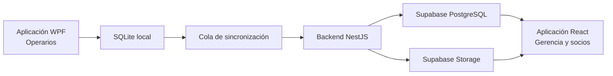

<div align="center">

# 🟡 Industrias Doradas

### Sistema de Gestión y Control de Producción Minera

Solución local-first para digitalizar, centralizar y mejorar los procesos operativos y administrativos de Industrias Doradas.

<br>


<br>


</div>

---

## 📋 Descripción

Este repositorio contiene el análisis, diseño y desarrollo del **Sistema de Gestión y Control de Producción Minera para Industrias Doradas**.

El proyecto se desarrolla como parte de la **Práctica Profesional Supervisada de la carrera de Ingeniería en Sistemas de la Universidad Nacional de Costa Rica**.

Industrias Doradas es una empresa de reciente creación dedicada al procesamiento de material minero en el cantón de Abangares, Guanacaste. Actualmente, gran parte de su información operativa se registra manualmente en cuadernos y posteriormente se consolida en hojas de cálculo de Microsoft Excel.

La solución busca sustituir progresivamente estos procesos por un sistema intuitivo, confiable y adaptable a las condiciones reales de la planta.

---

## 🎯 Objetivo general

Desarrollar un sistema informático para la gestión y control de la producción minera en Industrias Doradas, con el propósito de optimizar el registro, administración y consulta de la información operativa y administrativa, apoyar la toma de decisiones y contribuir a la mejora de los procesos de la organización.

---

## 🧩 Componentes del sistema

| Componente | Tecnologías | Propósito |
|---|---|---|
| Aplicación de escritorio | .NET 10, C# y WPF | Operación de planta y funcionamiento sin conexión |
| Almacenamiento local | SQLite | Continuidad operativa durante interrupciones de internet |
| Backend | Node.js, TypeScript y NestJS | Reglas de negocio, seguridad, auditoría y sincronización |
| Aplicación web | React, TypeScript y Vite | Administración, indicadores y reportes |
| Interfaz web | Tailwind CSS y shadcn/ui | Diseño adaptable y componentes accesibles |
| Estado remoto | TanStack Query | Consultas, caché, reintentos y actualización de datos |
| Formularios web | React Hook Form y Zod | Captura y validación de información |
| Gráficos | Recharts | Indicadores y visualización de rendimiento |
| Base central | Supabase PostgreSQL | Consolidación y consulta remota de información |
| Autenticación | Supabase Auth | Gestión de sesiones e identidad |
| Archivos | Supabase Storage | Fotografías y documentos sincronizados |

---

## 🏭 Funcionalidades previstas

- Gestión de empresas, plantas, terminales y líneas.
- Registro visual de cajuelas procesadas.
- Producción por línea, turno y operario.
- Administración de proveedores y cargamentos.
- Alertas de barrida cada 50 cajuelas.
- Registro de barridas y consumo de mercurio.
- Medición del oro recuperado en palos y gramos.
- Indicadores de rendimiento por cargamento y proveedor.
- Registro de horas trabajadas.
- Check-in mediante cámara y reconocimiento facial.
- Control de inventarios, herramientas e insumos.
- Registro de paros, mantenimiento e incidentes.
- Reportes y exportación a Microsoft Excel.
- Auditoría de operaciones.
- Funcionamiento local sin internet.
- Sincronización incremental con Supabase.
- Portal administrativo compatible con computadoras y móviles.

---

## 🏗️ Arquitectura propuesta



La aplicación de escritorio seguirá un enfoque **local-first**. Los operarios podrán registrar información aunque se interrumpa el internet satelital.

Cuando la conexión regrese, el sistema enviará únicamente las operaciones pendientes. No será necesario actualizar o descargar la base de datos completa.

---

## 🔄 Sincronización

La sincronización se fundamentará en:

- Identificadores UUID generados desde el origen.
- Registro de movimientos en lugar de sobrescribir contadores.
- Cola local de operaciones pendientes.
- Reintentos automáticos.
- Operaciones idempotentes.
- Cursores de sincronización incremental.
- Auditoría de cambios.
- Resolución controlada de conflictos.
- Sincronización separada de fotografías y archivos.
- Fechas almacenadas en UTC.

---

## 📁 Organización del repositorio

```text
industrias-doradas/
├── apps/
│   ├── api/                    # Backend NestJS
│   ├── desktop/                # Aplicación WPF
│   └── web/                    # Portal React
│
├── supabase/
│   ├── migrations/             # Migraciones de PostgreSQL
│   └── seed/                   # Datos de desarrollo
│
├── docs/
│   ├── architecture/           # Arquitectura
│   ├── decisions/              # Decisiones técnicas
│   └── requirements/           # Requerimientos
│
├── scripts/                    # Automatización
├── README.md
└── .gitignore
```

---

## 💻 Tecnologías

### Aplicación de escritorio

- .NET 10
- C# 14
- WPF
- MVVM
- SQLite
- Entity Framework Core
- HttpClient
- OpenCV u otra biblioteca biométrica por definir

### Backend

- Node.js 24 LTS
- TypeScript
- NestJS
- Supabase PostgreSQL
- OpenAPI y Swagger
- Validación mediante DTO
- Autenticación mediante JWT
- Pruebas con Jest

### Aplicación web

- React
- TypeScript
- Vite
- React Router
- TanStack Query
- Tailwind CSS
- shadcn/ui
- React Hook Form
- Zod
- Recharts
- Vitest
- Testing Library
- Playwright

### Infraestructura

- Supabase Database
- Supabase Auth
- Supabase Storage
- Git y GitHub
- GitHub Actions
- Trello

---

## 🛠️ Requisitos de desarrollo

Antes de trabajar en el proyecto se necesita:

| Herramienta | Versión recomendada |
|---|---|
| Node.js | 24 LTS |
| npm | Incluido con Node.js |
| pnpm | 11 o superior |
| .NET SDK | 10 |
| Visual Studio | 2026 |
| Git | Versión estable reciente |
| Navegador | Chrome, Edge, Firefox o Safari |
| Cuenta de Supabase | Plan gratuito para desarrollo |

En Visual Studio debe instalarse la carga de trabajo:

```text
Desarrollo de escritorio de .NET
```

No se deben instalar globalmente React, NestJS, Vite, Tailwind ni las demás bibliotecas. Estas dependencias estarán versionadas dentro del repositorio.

---

## ✅ Comprobar el entorno

```powershell
node --version
npm.cmd --version
pnpm.cmd --version
dotnet --version
git --version
```

Resultados esperados:

```text
Node.js 24.x
npm 11.x
pnpm 11.x
.NET SDK 10.x
Git instalado
```

---

## 🚀 Instalación del proyecto

> Esta sección se completará cuando se generen las tres aplicaciones.

```powershell
git clone URL_DEL_REPOSITORIO
cd industrias-doradas
pnpm.cmd install
```

Las instrucciones específicas para ejecutar escritorio, backend y web se agregarán después de crear los proyectos iniciales.

---

## 🚧 Estado del proyecto

- [x] Diagnóstico de la situación actual.
- [x] Identificación inicial de requerimientos.
- [x] Selección preliminar de tecnologías.
- [x] Definición de la arquitectura general.
- [x] Creación del repositorio.
- [ ] Configuración del monorepo.
- [ ] Creación del backend NestJS.
- [ ] Configuración de Supabase.
- [ ] Creación de la aplicación WPF.
- [ ] Implementación de SQLite.
- [ ] Implementación de la sincronización.
- [ ] Creación de la aplicación React.
- [ ] Pruebas con usuarios.
- [ ] Implementación en la empresa.

---

## 🗓️ Metodología

El desarrollo se realizará mediante **Scrum**, utilizando entregas incrementales y reuniones periódicas de seguimiento.

El trabajo se organizará mediante:

- Product Backlog.
- Sprints.
- Historias de usuario.
- Criterios de aceptación.
- Revisiones con la empresa.
- Validaciones con el tutor académico.
- Gestión de tareas mediante Trello.

---

## 🎓 Información académica

| Campo | Información |
|---|---|
| Institución | Universidad Nacional de Costa Rica |
| Carrera | Ingeniería en Sistemas |
| Curso | Práctica Profesional Supervisada |
| Profesor o supervisor | Enrique Gómez |
| Empresa beneficiaria | Industrias Doradas |
| Ubicación | Abangares, Guanacaste, Costa Rica |
| Duración aproximada | 17 semanas |
| Metodología | Scrum |

---

## 👥 Participantes

| Nombre | Rol |
|---|---|
| Steven Venegas | Desarrollo de software |
| Pendiente | Participante |
| Pendiente | Participante |
| Pendiente | Participante |

---

## 🔐 Seguridad

Debido a que el sistema administrará información operativa, financiera y biométrica, se contemplarán:

- Autenticación y autorización por roles.
- Protección de credenciales.
- Cifrado de información sensible.
- Auditoría de operaciones.
- Control de acceso a fotografías.
- Consentimiento para datos biométricos.
- Copias de seguridad.
- Recuperación ante fallos.
- Variables de entorno para secretos.

> Ninguna contraseña, clave privada o credencial de Supabase debe almacenarse en el repositorio.

---

## 📌 Alcance inicial

La primera versión estará orientada a una planta y una línea de producción, conservando una estructura preparada para incorporar más líneas, terminales y sucursales.

Las integraciones con sensores, maquinaria pesada, PLC o sistemas industriales no forman parte del alcance inicial.

---

## 📄 Licencia

Este proyecto se desarrolla con fines académicos y empresariales para Industrias Doradas.

La distribución, modificación o utilización del código deberá ser autorizada por los participantes y la organización beneficiaria.

---

<div align="center">

**Universidad Nacional de Costa Rica — Ingeniería en Sistemas**

Proyecto de Práctica Profesional Supervisada

</div>
