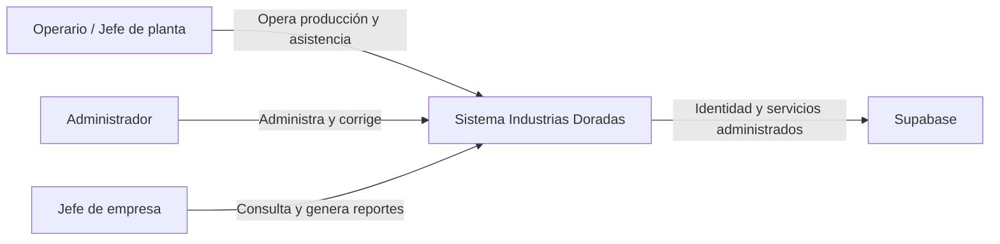
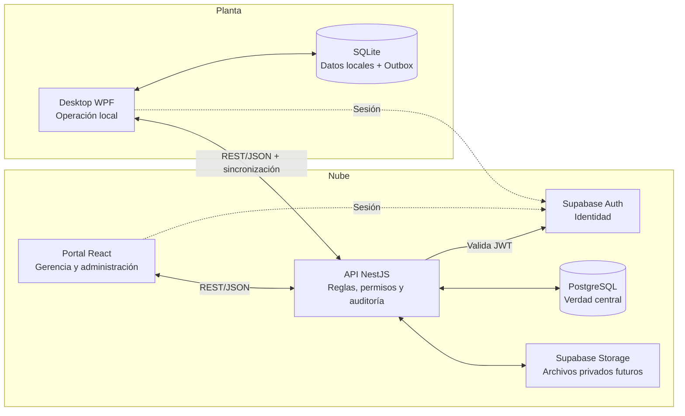
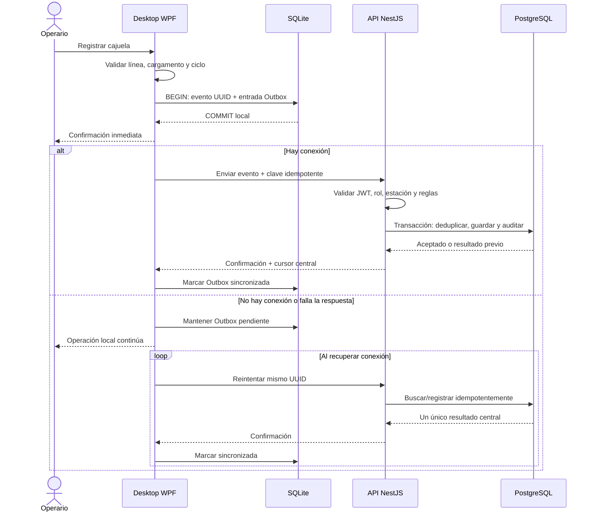

# Arquitectura del sistema

Este documento resume la arquitectura aceptada. Los detalles y consecuencias de
cada decisión están en `docs/decisions/`.

## C4 nivel 1: contexto

El sistema sustituye registros manuales progresivamente. Sensores, PLC,
contabilidad, nómina completa y aplicación móvil nativa quedan fuera del alcance
inicial.

## C4 nivel 2: contenedores

Las flechas hacia Auth representan identidad, no acceso directo a tablas de
negocio. NestJS es la única puerta remota a datos y reglas operativas.

## Responsabilidad y validación

| Capa | Responsabilidad |
| --- | --- |
| Desktop | Interacción, reglas necesarias offline, transacción SQLite + Outbox y respuesta inmediata. |
| Web | Interacción, validación de forma y presentación; no es autoridad de permisos. |
| NestJS | Autoridad de casos de uso: identidad, permisos, organización, reglas, idempotencia y auditoría. |
| PostgreSQL | Restricciones finales, unicidad, relaciones, transacciones y verdad central. |
| Supabase Auth | Identidad, sesiones y futura MFA; no decide roles funcionales. |

Una validación en cliente mejora la experiencia, pero nunca sustituye la
revalidación del API ni las restricciones de base de datos.

## Secuencia: registro local y sincronización

Si el servidor aceptó una operación pero la respuesta se perdió, el reintento
usa el mismo UUID y recibe el resultado existente. No crea otra cajuela.

## Cambios centrales hacia desktop

El escritorio solicita cambios posteriores a su cursor. Una corrección
administrativa se aplica localmente como cambio trazable y genera una
notificación al jefe de planta. Durante una caída no se promete que dos
estaciones vean lo mismo al instante; al volver la red deben converger sin borrar
historial.

## Ubicación de secretos

| Dato | Ubicación permitida | Prohibido |
| --- | --- | --- |
| URL y anon key de Supabase | Variables del API; variables públicas web cuando se integre Auth | Tratarlas como autorización administrativa |
| `service_role` | Gestor de secretos/variables del proceso NestJS | Web, desktop, Git, logs y capturas |
| Sesión de usuario | Almacenamiento seguro del cliente, con expiración | Logs, URL, repositorio |
| Clave privada o certificado | Gestor de secretos del despliegue | Archivos versionados |

Los ejemplos están en `.env.example`; los valores reales nunca se versionan.
`pnpm.cmd run secrets:check` funciona como alarma adicional.

## Límites y evolución

- No hay conexión productiva a Supabase ni SQLite implementado aún; estos ADR
  guían los sprints responsables.
- Conflictos multiestación, cursores y política de retención se detallan en
  Sprint 3.
- Un servidor local, broker externo o microservicio requiere un ADR nuevo y una
  necesidad medida.

