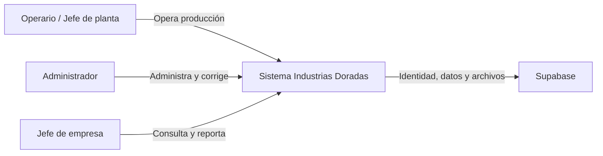
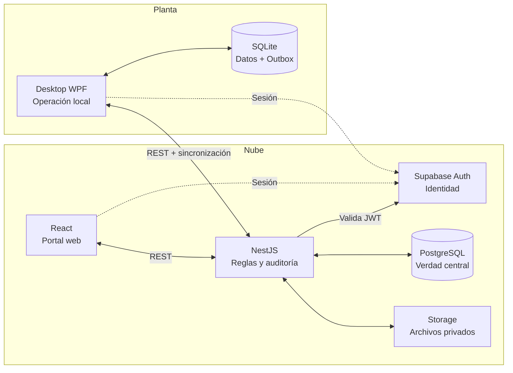
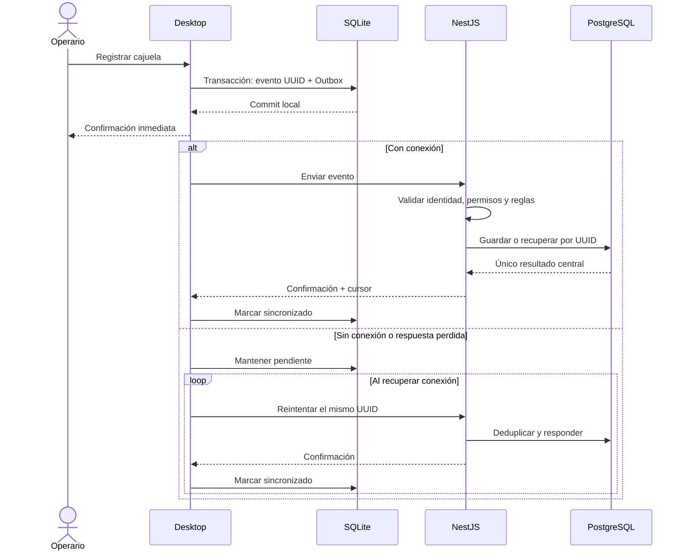

# Arquitectura y decisiones técnicas

Este documento reúne los diagramas y las decisiones arquitectónicas aceptadas
el 2026-08-14. Si una decisión cambia, se agrega una sección con fecha y motivo;
no se reescribe el historial silenciosamente.

## Contexto C4

## Contenedores C4

NestJS es la única puerta remota a datos de negocio. Web y desktop usan
Supabase Auth para identidad, no para consultar directamente las tablas.

## Decisiones aceptadas

### 1. Monolito modular

- **Decisión:** una API desplegable organizada por módulos de negocio.
- **Motivo:** equipo pequeño y reglas compartidas entre producción, barridas,
  asistencia e inventario.
- **Descartado:** microservicios, proyecto sin límites y CQRS completo.
- **Consecuencia:** despliegue y transacciones simples; las fronteras deben
  protegerse con revisión y pruebas. Solo se separa un módulo con evidencia.

### 2. Supabase Auth para identidad

- **Decisión:** Supabase emite JWT; NestJS valida sesión y resuelve cuenta, rol,
  organización y permisos propios.
- **Motivo:** evitar autenticación casera sin delegar autorización de negocio.
- **Descartado:** roles únicamente en el JWT y cuentas compartidas con todos los
  privilegios.
- **Consecuencia:** MFA y dispositivos autorizados son obligatorios antes de
  producción; offline admite solo sesiones previamente válidas.

### 3. PostgreSQL central

- **Decisión:** PostgreSQL de Supabase conserva la verdad central mediante
  migraciones, restricciones, UUID, UTC, decimales y auditoría.
- **Motivo:** relaciones, integridad y consolidación multiestación.
- **Descartado:** SQLite compartido por red, base documental y servidor local
  desde el inicio.
- **Consecuencia:** respaldo, restauración y RLS deben ensayarse; la nube nunca
  bloquea el registro local.

### 4. SQLite local-first

- **Decisión:** desktop guarda la mutación y Outbox en una transacción SQLite
  antes de confirmar en pantalla.
- **Motivo:** operar uno o dos días sin Internet y confirmar cajuelas rápidamente.
- **Descartado:** nube primero, archivos JSON y servidor local prematuro.
- **Consecuencia:** se requieren migraciones y protección local; durante una
  caída se garantiza convergencia posterior, no simultaneidad.

### 5. NestJS como puerta de negocio

- **Decisión:** toda operación remota atraviesa NestJS, que valida identidad,
  permisos, organización, estación, reglas, idempotencia y auditoría.
- **Motivo:** una autoridad central sin duplicar reglas en clientes.
- **Descartado:** acceso directo de clientes a Supabase, reglas solo en RLS y un
  backend distinto por cliente.
- **Consecuencia:** la API puede ser cuello de botella; desktop valida lo mínimo
  offline y NestJS siempre revalida al sincronizar.

### 6. REST/JSON y OpenAPI

- **Decisión:** API versionada bajo `/api/v1`, descrita con OpenAPI.
- **Motivo:** contratos sencillos para navegador, .NET y pruebas manuales.
- **Descartado:** GraphQL, gRPC y WebSockets como contrato principal.
- **Consecuencia:** cambios incompatibles exigen versión o migración; SSE,
  polling o WebSocket podrán complementar notificaciones.

### 7. Outbox e idempotencia

- **Decisión:** cada mutación usa UUID de origen; desktop reintenta el mismo
  evento y PostgreSQL registra una clave única dentro de la transacción.
- **Motivo:** una respuesta perdida no debe perder ni duplicar cajuelas.
- **Descartado:** enviar una vez, sobrescribir contadores, cola externa inicial y
  último escritor gana para todo.
- **Consecuencia:** se necesitan estados, reintentos e índices únicos; la
  idempotencia evita duplicados pero no resuelve conflictos semánticos.

### 8. React para web

- **Decisión:** React + TypeScript + Vite, React Router y TanStack Query.
- **Motivo:** portal responsive, bilingüe y accesible sin aplicación móvil nativa.
- **Descartado:** app móvil, Blazor, HTML sin framework y acceso directo a
  Supabase.
- **Consecuencia:** deben probarse navegadores, accesibilidad, idiomas y estados
  vacío/carga/error; todo valor `VITE_*` es público.

## Dónde se valida cada regla

| Capa | Responsabilidad |
| --- | --- |
| Desktop | Experiencia, reglas necesarias offline y transacción SQLite + Outbox. |
| Web | Formularios y presentación; nunca es autoridad de permisos. |
| NestJS | Casos de uso, identidad, permisos, reglas, idempotencia y auditoría. |
| PostgreSQL | Relaciones, unicidad, restricciones y transacciones finales. |
| Supabase Auth | Identidad y sesiones; no define roles funcionales. |

Validar en el cliente mejora la experiencia, pero no reemplaza NestJS ni las
restricciones de PostgreSQL.

## Registro offline y sincronización

Una corrección administrativa llega después del cursor local, se aplica como
cambio trazable y genera una notificación. Nunca se borra el historial para
forzar coincidencia.

## Secretos

| Dato | Permitido | Prohibido |
| --- | --- | --- |
| URL y anon key | API y cliente web cuando se integre Auth | Usarlas como permiso administrativo |
| `service_role` | Gestor de secretos del proceso NestJS | Web, desktop, Git, logs y capturas |
| Sesión | Almacenamiento seguro del cliente | URL, logs y repositorio |
| Claves privadas | Gestor de secretos del despliegue | Archivos versionados |

La conexión productiva, SQLite y sincronización se implementan en sus sprints;
este documento define sus límites, no afirma que ya existan.

