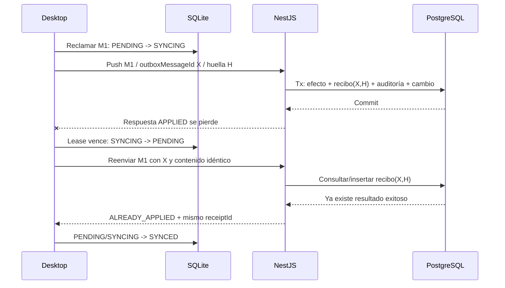

# Contrato de sincronización — Sprint 3.1

**Fecha:** 2026-09-08

**Estado:** aprobado para implementación; push 3.2 y endurecimiento concurrente
3.3 implementados, pendientes de pausa manual

**Alcance:** contrato push/pull, estados, idempotencia, tiempos, revalidación y
propagación. No implementa endpoint, tablas PostgreSQL, migración SQLite,
worker, pull ni transporte de notificaciones; corresponden a 3.2–3.8.

La inspección de solo lectura confirmó que desktop está en la versión local 5
y que Supabase de desarrollo contiene las seis migraciones de identidad,
auditoría, catálogos, PIN y permisos. Todavía no existen tablas centrales de
producción, recibos o feed de cambios; 3.1 no las crea ni aplica SQL remoto.

## 1. Invariantes

1. La confirmación visible de una mutación de planta ocurre después del commit
   de SQLite + Outbox y antes de cualquier intento de red.
2. HTTP, autenticación remota, backoff y pull nunca forman parte del recorrido
   de `Registrar cajuela`.
3. Un reintento vuelve a enviar el mismo `outboxMessageId` y el mismo contenido.
   No genera otro evento ni otro UUID para “arreglar” una respuesta perdida.
4. PostgreSQL confirma en una sola transacción el efecto de negocio, su recibo
   idempotente, la auditoría y el cambio que alimentará el pull.
5. Un elemento inválido no revierte elementos válidos del mismo lote. La unidad
   transaccional e idempotente es cada elemento, no el lote completo.
6. Eventos de producción y correcciones son append-only. Catálogos centrales
   pueden actualizar su proyección local, pero nunca reescriben hechos locales.
7. Ningún cliente accede directamente a tablas de negocio, recibos o feed en
   Supabase. Desktop usa Supabase directamente solo para Auth; NestJS sigue
   siendo la puerta remota.
8. Un fallo, una revocación o una autorización vencida no elimina mutaciones
   confirmadas localmente.

## 2. Superficie HTTP versionada

Los endpoints previstos conservan el alcance explícito de organización y
estación:

| Método | Ruta | Responsabilidad |
| --- | --- | --- |
| `POST` | `/api/v1/organizations/{organizationId}/stations/{stationId}/sync/push` | Ingerir un lote y responder por elemento. |
| `GET` | `/api/v1/organizations/{organizationId}/stations/{stationId}/sync/changes?cursor=...&limit=...` | Entregar cambios autorizados mediante cursor opaco. |
| `GET` | `/api/v1/organizations/{organizationId}/stations/{stationId}/sync/signals` | Señal SSE opcional de que puede haber cambios; nunca transporta la verdad de negocio. |

El push se implementa en 3.2. El pull y la señal se implementan en 3.5. Si SSE
no está disponible, el cliente usa polling incremental. Recibir una señal solo
adelanta el próximo pull; no permite modificar SQLite con el contenido de la
señal.

La revalidación al recuperar conexión reutiliza los contratos existentes:

1. renovar el access token con el refresh token protegido;
2. consultar `/api/v1/auth/session`;
3. consultar
   `/api/v1/organizations/{organizationId}/stations/{stationId}/session-snapshot`;
4. comparar cuenta activa, rol, organización, estación, planta y versión de
   permisos;
5. guardar de forma protegida `validatedAt` y `offlineValidUntil` recibidos;
6. solo entonces iniciar push, pull y escucha de señales.

NestJS vuelve a validar el JWT y el alcance en **cada** solicitud de sync. El
snapshot local mejora continuidad, pero nunca sustituye la autorización central
cuando hay red.

## 3. Envelope push v1

El cuerpo lógico de una solicitud es:

```jsonc
{
  "contractVersion": 1,
  "batchId": "<uuid nuevo para este intento HTTP>",
  "sentAtUtc": "<ISO-8601 UTC>",
  "client": {
    "application": "desktop",
    "applicationVersion": "<versión instalada>"
  },
  "scope": {
    "organizationId": "<uuid>",
    "plantId": "<uuid>",
    "stationId": "<uuid>"
  },
  "items": [
    {
      "outboxMessageId": "<uuid estable>",
      "stationSequence": 1,
      "operationType": "PRODUCTION_EVENT_CREATED",
      "aggregateType": "production_event",
      "aggregateId": "<uuid estable>",
      "payloadSchemaVersion": 2,
      "createdAtUtc": "<ISO-8601 UTC>",
      "authorization": {
        "actorProfileId": "<uuid del jefe que abrió la estación>",
        "permissionVersion": 1,
        "validatedAtUtc": "<ISO-8601 UTC>",
        "offlineValidUntilUtc": "<ISO-8601 UTC>",
        "stateAtCapture": "VALID"
      },
      "payload": {}
    }
  ]
}
```

### 3.1 Identidades

- `batchId` solo correlaciona un intento HTTP. Puede cambiar al reintentar y no
  decide idempotencia.
- `outboxMessageId` identifica para siempre la mutación que se transmite y es
  la clave idempotente primaria dentro de organización + estación.
- `aggregateId` identifica el hecho o agregado de negocio. Para
  `PRODUCTION_EVENT_CREATED` coincide con `clientEventId`.
- `stationSequence` es una secuencia positiva y monotónica para **todas** las
  mutaciones Outbox de una estación. No sustituye `clientSequence`, que sigue
  ordenando solo eventos de producción.
- Los elementos se envían por `stationSequence` ascendente. No se exige que un
  lote contenga secuencias contiguas: un elemento en revisión no debe bloquear
  indefinidamente los independientes posteriores.

### 3.2 Tamaño

- El worker usará inicialmente hasta 100 elementos por lote.
- La API aceptará como máximo 500 elementos para mantener coherencia con los
  límites actuales del repositorio local.
- Estos valores son configuración técnica, no una regla de negocio. Un lote
  vacío o mayor al máximo se rechaza completo antes de procesar elementos.

### 3.3 Autorización capturada

`authorization` conserva la evidencia disponible **cuando se confirmó la
mutación local**, no la sesión que casualmente exista al enviarla.

`stateAtCapture` admite:

| Valor | Significado |
| --- | --- |
| `VALID` | Ocurrió dentro de la autorización offline vigente. |
| `EXPIRED_CONTINGENCY` | Ocurrió después de 24 horas sin revalidación y requiere revisión central. |
| `LEGACY_UNAVAILABLE` | El registro es anterior al contrato 3.1 y SQLite no conserva evidencia suficiente. |

La Outbox existente no captura esta evidencia para las cajuelas. La futura
migración no debe inventarla: los pendientes anteriores se etiquetarán
`LEGACY_UNAVAILABLE`, conservarán sus tiempos originales y se someterán a la
política explícita del servidor. Ningún evento se descarta por ser legado.

## 4. Operaciones y esquemas aceptados inicialmente

| `operationType` | `aggregateType` | Esquema actual | Dependencia central |
| --- | --- | ---: | --- |
| `OPERATION_STARTED` | `shipment` | 1 | proveedor, línea, responsable y estación. |
| `RESPONSIBLE_RELIEVED` | `shipment` | 1 | cargamento/ciclo y responsable anterior vigentes. |
| `OPERATION_COMPLETED` | `shipment` | 1 | cargamento/ciclo existentes. |
| `PRODUCTION_EVENT_CREATED` | `production_event` | 2 | cargamento, ciclo, línea, responsable y, para reverso, evento objetivo. |

El servidor mantiene una matriz explícita de versiones admitidas por tipo. La
versión del envelope y la del payload evolucionan por separado. Un envelope no
soportado rechaza el lote completo; un payload no soportado produce un resultado
permanente solo para ese elemento.

Los campos derivados recibidos —por ejemplo `quantityDelta` y `workPeriod`— se
recalculan y comparan. No se aceptan como una segunda fuente de verdad.

## 5. Huella e idempotencia

NestJS valida el DTO tipado y calcula una huella SHA-256 sobre la representación
normalizada de estos campos:

- organización, planta y estación;
- `outboxMessageId`, `stationSequence`, operación, agregado y versión;
- autorización capturada;
- payload completo validado.

La normalización ordena propiedades, representa UUID en formato canónico y
normaliza timestamps a UTC antes de calcular la huella. El hash enviado por un
cliente, si se incluye para diagnóstico, nunca sustituye el cálculo del
servidor.

PostgreSQL debe imponer al menos:

- unicidad `(organization_id, station_id, outbox_message_id)` en recibos;
- unicidad `(organization_id, station_id, station_sequence)`;
- unicidad del `client_event_id` central dentro de la organización;
- unicidad `(organization_id, station_id, client_sequence)` para eventos de
  producción;
- una reversión efectiva por evento agregado;
- claves foráneas e índices para cada relación consultada.

Algoritmo por elemento:

1. abrir una transacción corta;
2. tomar un bloqueo transaccional derivado de organización + estación +
   `outboxMessageId` antes de buscar o insertar el recibo;
3. si existe la misma clave y huella, devolver el resultado durable anterior;
4. si existe la misma clave con otra huella, registrar
   `IDEMPOTENCY_CONTENT_MISMATCH` y enviar el elemento a revisión;
5. validar dependencias e insertar el hecho de negocio de forma idempotente;
6. insertar auditoría y entrada del feed incremental;
7. confirmar todo junto.

No se mantiene una transacción abierta durante llamadas HTTP externas. Las
operaciones concurrentes bloquean recursos siempre en orden estable y se
apoyan en restricciones y bloqueos transaccionales, no en memoria del proceso
NestJS.

Desde 3.3, el RPC público es un wrapper `SECURITY INVOKER` que obtiene un
`pg_advisory_xact_lock` por clave idempotente y llama a la implementación
interna dentro de la misma transacción. La función interna no es ejecutable por
`anon` ni `authenticated`. Además, PostgreSQL impone unicidad para la secuencia
global de estación, la secuencia de eventos de producción y el evento objetivo
de una reversión. El recibo y la auditoría del primer intento conservan el mismo
`correlationId`; los reintentos reciben el identificador durable ya creado.

## 6. Respuesta push v1

Un envelope válido devuelve HTTP `200` aunque contenga resultados distintos:

```jsonc
{
  "contractVersion": 1,
  "batchId": "<eco del request>",
  "serverReceivedAtUtc": "<ISO-8601 UTC>",
  "serverCompletedAtUtc": "<ISO-8601 UTC>",
  "results": [
    {
      "outboxMessageId": "<uuid>",
      "stationSequence": 1,
      "status": "APPLIED",
      "receiptId": "<uuid durable>",
      "code": "APPLIED",
      "processedAtUtc": "<ISO-8601 UTC>"
    }
  ]
}
```

| Estado por elemento | Efecto central | Estado local siguiente |
| --- | --- | --- |
| `APPLIED` | Efecto y recibo fueron confirmados por primera vez. | `SYNCED` |
| `ALREADY_APPLIED` | La misma clave y huella ya tenían recibo exitoso. | `SYNCED` |
| `RETRY_LATER` | No existe confirmación terminal; el fallo es transitorio. | `PENDING` con backoff |
| `FAILED_REVIEW` | Rechazo durable o conflicto que requiere atención. | `FAILED_REVIEW` |

La respuesta nunca devuelve el payload completo ni datos secretos. Cada código
es estable y seguro para diagnóstico. Un elemento dependiente de otro que aún no
pudo aplicarse usa `RETRY_LATER/DEPENDENCY_NOT_READY`; si la dependencia fue
rechazada de forma permanente usa `FAILED_REVIEW/DEPENDENCY_REJECTED`.

### 6.1 HTTP fuera de la respuesta por elemento

| Resultado HTTP | Interpretación local |
| --- | --- |
| `400` | Envelope ilegible/inválido; liberar reclamo y poner sus elementos en revisión de contrato. |
| `401` | Renovar token una vez; si falla, cerrar autorización remota y conservar `PENDING`. |
| `403` | Alcance, cuenta o estación revocados; conservar datos y pasar a revisión con código seguro. |
| `413` | Reducir lote; ningún elemento fue procesado. |
| `422` | `contractVersion` no soportada; requiere actualización/revisión. |
| `429`, timeout, DNS, conexión, `5xx` | Liberar reclamo y volver a `PENDING` con backoff+jitter. |

Ante una desconexión no se presupone que el servidor “no hizo nada”. Se
reintentan exactamente los mismos elementos y se deja que los recibos decidan.

## 7. Procesamiento parcial

El envelope se valida antes de iniciar. Después, la API procesa elementos por
`stationSequence` ascendente, cada uno en su propia transacción. Por tanto:

- un error de forma del envelope procesa cero elementos;
- un elemento inválido queda aislado;
- elementos independientes posteriores pueden confirmarse;
- elementos dependientes se clasifican explícitamente;
- si el proceso cae a mitad del lote, algunos elementos pueden estar
  confirmados aunque el cliente no haya recibido respuesta;
- el reintento completo recupera el resultado durable de esos elementos y
  procesa los restantes sin duplicar efectos.

Esta semántica se prefiere a una transacción de lote completo porque evita que
un “elemento venenoso” impida sincronizar una jornada completa.

## 8. Estados locales

Los nombres canónicos del Sprint 3 son:

```text
PENDING -> SYNCING -> SYNCED
                  -> PENDING          (fallo transitorio)
                  -> FAILED_REVIEW    (fallo permanente/conflicto)
```

| Estado | Significado |
| --- | --- |
| `PENDING` | Confirmado localmente y elegible cuando llegue `nextAttemptAtUtc`. |
| `SYNCING` | Reclamado mediante `claimId` y lease; nunca significa aceptación central. |
| `SYNCED` | Existe resultado `APPLIED` o `ALREADY_APPLIED` y recibo compatible. Terminal. |
| `FAILED_REVIEW` | Se conserva, no reintenta automáticamente y requiere decisión visible. |

Reglas:

- reclamar es una actualización atómica de un lote elegible;
- `attemptCount` aumenta al iniciar un intento de red, no al consultar la cola;
- un `SYNCING` cuyo lease vence vuelve a `PENDING` al arrancar o reclamar;
- `SYNCED` nunca vuelve automáticamente a pendiente;
- `FAILED_REVIEW` nunca se borra ni se libera automáticamente;
- una resolución crea evidencia administrativa y, si corresponde, una nueva
  mutación/compensación; no altera el payload original.

### 8.1 Migración desde los estados de Sprint 2

Las migraciones 001–005 no se reescriben. Una migración SQLite nueva deberá
reconstruir la restricción de estados y mapear:

| Estado legado | Estado inicial Sprint 3 | Motivo |
| --- | --- | --- |
| `PENDING` | `PENDING` | Nunca reclamado. |
| `IN_FLIGHT` | `PENDING` | No existe lease fiable; reintentar es más seguro. |
| `CONFIRMED` | `SYNCED` | Ya tenía confirmación según el contrato legado. |
| `FAILED` | `PENDING` | El repositorio actual lo considera reintentable. |

La evolución agregará `station_id`, `station_sequence`, `claim_id`,
`claimed_at_utc`, `lease_until_utc`, `last_error_code`, `last_http_status`,
`synced_at_utc`, `central_receipt_id` y la autorización capturada. Los mensajes
anteriores reciben secuencia determinista por `created_at_utc` y el orden local
estable disponible; no se modifican sus payloads ni tiempos.

## 9. Timestamps y reloj

| Campo | Autoridad | Regla |
| --- | --- | --- |
| `occurredAtUtc` | Estación al ocurrir el hecho | Inmutable; nunca se reemplaza por hora del servidor. |
| `recordedAtUtc` | Estación al confirmar SQLite | Inmutable. |
| `createdAtUtc` | Outbox local | Inmutable. |
| `sentAtUtc` | Intento HTTP | Cambia en cada intento. |
| `serverReceivedAtUtc` | API | Hora de recepción, solo metadato. |
| `processedAtUtc` | PostgreSQL/API | Hora del recibo terminal. |
| `syncedAtUtc` | Estación | Hora local de aplicación de la respuesta. |
| `changedAtUtc` | Servidor | Hora autoritativa del cambio entregado por pull. |

La respuesta incluye hora de servidor para medir desviación. Una desviación no
reescribe hechos; se muestra en diagnóstico y puede clasificar nuevos elementos
para revisión según la política de 3.6.

## 10. Pull incremental v1

El cursor es una cadena opaca emitida por NestJS. Internamente puede representar
una secuencia central, pero desktop no la analiza, fabrica ni retrocede.

Respuesta lógica:

```jsonc
{
  "contractVersion": 1,
  "requestedCursor": "<cursor o null para bootstrap>",
  "nextCursor": "<cursor opaco>",
  "hasMore": false,
  "serverTimeUtc": "<ISO-8601 UTC>",
  "changes": [
    {
      "changeId": "<uuid>",
      "serverSequence": 1,
      "entityType": "SUPPLIER",
      "entityId": "<uuid>",
      "entityVersion": 2,
      "action": "UPSERT",
      "changedAtUtc": "<ISO-8601 UTC>",
      "payloadSchemaVersion": 1,
      "payload": {}
    }
  ]
}
```

Entidades iniciales previstas: proveedores, trabajadores, líneas/componentes,
estaciones y sus alcances, cargamentos/asignaciones, política/autorización de la
estación y correcciones administrativas.

Acciones admitidas:

- `UPSERT`: crear o actualizar la proyección central autoritativa;
- `DEACTIVATE`: inactivar sin borrar referencias históricas;
- `CORRECTION_APPENDED`: aplicar una corrección nueva y auditable sin modificar
  el evento original.

Cada página se aplica en una única transacción SQLite junto con `nextCursor`.
Si la aplicación cae antes del commit, vuelve a pedir el cursor anterior. Un
cambio repetido con el mismo `changeId` y versión es idempotente; la misma
identidad con contenido distinto se envía a revisión.

El bootstrap pagina únicamente el alcance autorizado y los registros inactivos
necesarios para referencias históricas; no descarga tablas de otras plantas ni
una copia general de la base. Un cursor expirado produce un código explícito y
un bootstrap controlado, nunca un borrado previo de SQLite.

## 11. Conflictos y correcciones entrantes

- Producción local confirmada no se reemplaza por una fila central.
- Una corrección administrativa llega como entidad propia, con actor, motivo,
  objetivo, versión y hora central.
- Desktop conserva el evento objetivo y agrega la corrección a una proyección
  separada; después reconstruye el total visible de forma trazable.
- Una desactivación de proveedor, trabajador o línea impide nuevas selecciones,
  pero conserva nombres/IDs necesarios para cargamentos y eventos existentes.
- Una versión de catálogo menor o igual ya aplicada se ignora idempotentemente;
  una misma versión con otro contenido queda en revisión.
- Las reglas concretas para estación/línea revocada, solapamiento y reloj
  desviado se completan en 3.6–3.7 sin cambiar estas invariantes.

## 12. Datos que nunca se sobrescriben

- UUID del evento, Outbox, cargamento, ciclo, asignación y confirmación;
- organización, planta, estación, línea, cargamento y responsable capturados;
- tipo, secuencias y destino de reversión;
- `occurredAtUtc`, `recordedAtUtc`, `createdAtUtc` y jornada original;
- origen de entrada y motivo/confirmación de corrección;
- evidencia de autorización capturada;
- payload y huella asociados a un recibo;
- auditoría, recibos terminales y cursores ya confirmados.

Solo cambian metadatos de transporte (`state`, intentos, lease, próximo intento,
error seguro, recibo y `syncedAtUtc`) y proyecciones reconstruibles. Un cambio de
catálogo central no reetiqueta eventos históricos.

## 13. Seguridad y exposición Supabase

- Todos los endpoints requieren JWT Supabase; NestJS consulta rol, cuenta,
  organización, permisos y estación actuales, no `user_metadata` editable.
- La URL y clave publicable pueden existir en desktop solo para Auth. La clave
  secreta permanece exclusivamente en el proceso API.
- Las futuras tablas de producción, recibos y feed viven en el esquema `app`,
  con RLS como defensa en profundidad y sin grants directos para `anon` o
  `authenticated`.
- No se publica `app` en la Data API para que desktop eluda NestJS.
- Supabase Realtime no es un canal directo de datos de negocio hacia desktop.
  La señal sale de NestJS y el pull autenticado obtiene el contenido.
- Logs y respuestas excluyen tokens, PIN/verificador, payload completo,
  fotografías, rutas privadas y secretos.

La revisión del changelog de Supabase del 2026-09-08 no encontró un cambio que
obligue a modificar este contrato. Se tuvo en cuenta que las tablas nuevas ya
no se exponen automáticamente a Data API y que el esquema interno `realtime`
está bloqueado contra modificaciones; ninguna de las dos capacidades se usa
como puerta de negocio.

## 14. Códigos estables iniciales

### Transitorios

- `NETWORK_UNAVAILABLE`
- `REQUEST_TIMEOUT`
- `RATE_LIMITED`
- `SERVER_TEMPORARY_FAILURE`
- `DEPENDENCY_NOT_READY`
- `AUTH_REFRESH_REQUIRED`

### Revisión

- `INVALID_ENVELOPE`
- `UNSUPPORTED_CONTRACT_VERSION`
- `UNSUPPORTED_PAYLOAD_SCHEMA`
- `IDEMPOTENCY_CONTENT_MISMATCH`
- `STATION_SEQUENCE_CONFLICT`
- `SCOPE_MISMATCH`
- `STATION_REVOKED`
- `AUTHORIZATION_EXPIRED_CONTINGENCY`
- `LEGACY_AUTHORIZATION_UNAVAILABLE`
- `INVALID_EVENT`
- `DEPENDENCY_REJECTED`
- `CLOCK_SKEW_REVIEW`

Los mensajes humanos pueden traducirse; estos códigos no cambian por idioma.

## 15. Pruebas exigidas a los pasos siguientes

1. lote válido, duplicado idéntico, UUID repetido con contenido distinto y lote
   mixto;
2. dos solicitudes concurrentes con el mismo elemento;
3. caída antes, durante y después del commit central;
4. respuesta perdida después del commit;
5. elemento inválido entre dos válidos;
6. reclamo abandonado y reinicio;
7. revalidación válida, token vencido, estación revocada y contingencia de más
   de 24 horas;
8. bootstrap, dos páginas, repetición de página, caída antes del cursor,
   desactivación y cursor expirado;
9. corrección administrativa sin alterar el evento original;
10. 10 000 pendientes con UI operativa sin bloqueo.

## 16. Pausa 3.1 — respuesta perdida

Caso para aprobación:



Resultado esperado:

- existe un solo efecto de negocio, un solo evento y un solo recibo terminal;
- la auditoría no presenta una segunda mutación, aunque puede registrar otro
  intento técnico correlacionado;
- el contador central cambia una sola vez;
- desktop reconoce la confirmación por `outboxMessageId` + recibo y no crea un
  nuevo UUID;
- si el contenido cambia, no se acepta como duplicado: queda
  `FAILED_REVIEW/IDEMPOTENCY_CONTENT_MISMATCH`.

La aprobación de esta secuencia cierra 3.1 y habilita 3.2. No autoriza todavía
el worker, el pull ni una migración en Supabase.
