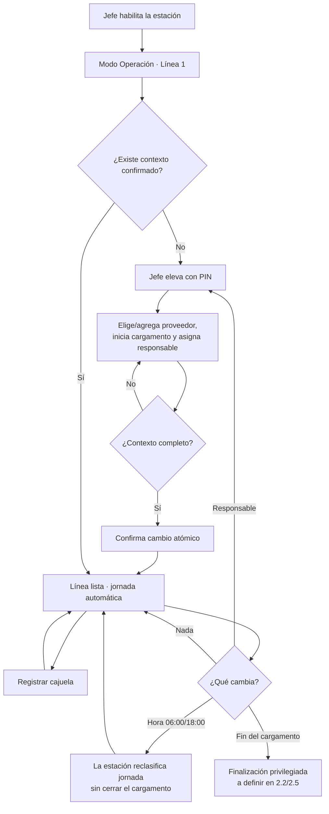

# Flujo operativo local — contrato provisional 2.1

**Fecha:** 2026-08-25

**Estado:** aprobado provisionalmente por el desarrollador jefe para iniciar
2.2; pendiente de validación posterior con la empresa y usuarios de planta

**Fuente funcional:**
`docs/requirements/linea-base-funcional-v0.1.md`

## 1. Propósito y alcance

Este documento define el flujo visible mínimo del Modo Operación para preparar
y operar una sola línea desde una computadora compartida. Incorpora las
respuestas disponibles del desarrollador jefe y registra por separado lo que
aún no ha podido comprobarse con cuadernos, Excel o usuarios de planta.

Este mini paso define:

- historias, vocabulario y recorrido de preparación;
- jornada automática y relevo de responsable sin cerrar el cargamento;
- continuidad del contexto anterior mientras se prepara un cambio;
- wireframes del piloto de una sola línea;
- riesgos y validaciones que deben retomarse con la empresa.

Este mini paso **no** implementa dominio, PostgreSQL, SQLite, Outbox,
sincronización, cajuelas, reversos, alertas, barridas, sensores ni código WPF.
Los estados de dominio definitivos corresponden al paso 2.2.

## 2. Evidencia y límite de aprobación

El repositorio confirma que la operación actual se registra en cuadernos y se
consolida en Excel, pero no contiene muestras de esos registros. El
desarrollador jefe indicó que todavía no se conocen con certeza sus columnas y
autorizó avanzar con la información disponible, corrigiendo después si fuera
necesario.

Por tanto:

- no se inventan columnas, códigos ni formatos del cargamento;
- las respuestas recibidas sí permiten diseñar el dominio 2.2;
- la aprobación es provisional y no equivale a validación con usuarios finales;
- los cambios visuales se difieren hasta una reunión posterior con la empresa;
- cualquier contradicción futura se corrige primero en la línea base funcional.

## 3. Reglas aceptadas para iniciar 2.2

1. Una cajuela es un balde de peso variable; no representa kilogramos.
2. Todo el MVP usa una computadora, una estación y una sola línea piloto.
3. La arquitectura podrá evolucionar después hasta cuatro líneas configurables,
   pero ese diseño visual no forma parte de la aprobación actual.
4. Modo Operación no es una cuenta ni un rol de Supabase.
5. El jefe de planta habilita la estación y se eleva temporalmente con su PIN.
6. Una línea que recibe material necesita un cargamento y exactamente un
   responsable principal vigente.
7. Un cargamento pertenece a un proveedor, usa exactamente una línea y nunca se
   reparte.
8. Un relevo agrega un nuevo responsable vigente sin borrar los anteriores. Se
   conserva el instante del cambio y el resumen final muestra a todos los
   responsables secuenciales.
9. Una persona puede responder por varios cargamentos o líneas. Los ayudantes no
   se asignan a la línea.
10. La jornada se calcula por la hora local `America/Costa_Rica`: diurna en
    `[06:00, 18:00)` y nocturna en `[18:00, 06:00)`.
11. El cambio de jornada o responsable no detiene la línea ni finaliza el
    cargamento.
12. Para la operación, el cargamento se reconoce por proveedor/empresa y hora
    automática de inicio; no se exige un código visible. El dominio usa UUID.
13. El jefe de planta puede registrar un proveedor faltante e iniciar un nuevo
    cargamento. El proveedor queda disponible para entregas futuras.
14. El administrador puede corregir errores posteriormente mediante una acción
    auditable; no se sobrescribe el historial en silencio.
15. Mientras el jefe prepara un cambio, el contexto confirmado anterior sigue
    activo. El nuevo contexto se sobrepone completo solo al confirmar.
16. La captura normal debe admitir clic, teclado y controlador USB/HID, y no
    puede depender de un sensor.
17. El objetivo futuro del registro local es responder en menos de 300 ms y
    explicar por separado guardado local, red y pendientes.

## 4. Actores y responsabilidades visibles

| Actor o modo | Necesidad | Acciones del flujo |
| --- | --- | --- |
| Jefe de planta | Preparar o cambiar el contexto de la línea | Elevar con PIN; elegir o agregar proveedor, iniciar cargamento, asignar/relevar responsable y confirmar. |
| Modo Operación | Mantener el conteo continuo sin cuenta compartida | Ver el contexto vigente y usar `Registrar cajuela`. |
| Estación | Clasificar y explicar el estado operativo | Calcular jornada, mostrar almacenamiento local, conexión y pendientes. |
| Administrador | Corregir errores posteriores | Ajustar datos mediante un caso de uso auditado, fuera del registro normal. |

La preparación identifica al jefe que confirma el contexto. El conteo se
atribuye a línea, cargamento, responsable vigente, estación y autorización; no
se inventa una identidad para quien pulsa físicamente el controlador.

## 5. Historias de usuario aceptadas

### HU-2.1-01 — Preparar la línea

Como jefe de planta, quiero elegir o registrar el proveedor, iniciar el
cargamento y asignar un responsable, para dejar lista la línea sin escribir
datos repetidos.

**Aceptación:**

- el piloto fija `Línea 1`; no muestra un selector con una sola opción;
- la jornada se muestra calculada y no se puede elegir manualmente;
- el proveedor puede seleccionarse o agregarse con autoridad de jefe;
- el cargamento nuevo toma automáticamente proveedor y hora de inicio;
- no se confirma si falta proveedor o responsable;
- un resumen precede a la confirmación.

### HU-2.1-02 — Registrar sin distracciones

Como persona en el punto de control, quiero reconocer el contexto y registrar
una cajuela con una sola acción, para no detener el trabajo.

**Aceptación:**

- `Registrar cajuela` ocupa el área dominante;
- proveedor, hora de inicio, responsable vigente y jornada permanecen visibles;
- `Guardado local` no se confunde con el estado de Internet;
- una línea sin contexto no habilita el registro.

### HU-2.1-03 — Relevar responsable sin cerrar el cargamento

Como jefe de planta, quiero asignar el siguiente responsable mientras la línea
continúa con el contexto anterior, para aplicar el relevo en un instante claro.

**Aceptación:**

- editar crea un borrador privilegiado y no altera el contexto vigente;
- cancelar conserva el responsable anterior;
- confirmar registra el instante del relevo y activa al nuevo responsable para
  los eventos posteriores;
- los eventos anteriores no se reetiquetan;
- el resumen del cargamento conserva ambos responsables.

### HU-2.1-04 — Entender una contingencia

Como persona en Modo Operación, quiero saber si la estación guarda localmente
aunque no haya Internet, para continuar con confianza.

**Aceptación:**

- `Guardado local disponible` es el estado operativo principal;
- `Sin Internet` no bloquea por sí solo;
- un fallo de escritura sí bloquea y ofrece una instrucción clara;
- no se exponen tokens, rutas internas, trazas ni detalles de base de datos.

## 6. Vocabulario visible provisional

| Concepto | Etiqueta | Nota |
| --- | --- | --- |
| `line_cycle` | Alimentación actual | Aceptada provisionalmente. |
| `work_period` | Jornada | Se calcula; no es un selector. |
| `shipment` | Cargamento | `Camionetada` es un sinónimo oral observado. |
| `principal_worker` | Responsable principal | Es una persona, no un usuario del sistema. |
| estación preparada | Línea lista | Aceptada provisionalmente. |
| acción positiva | Registrar cajuela | Aceptada provisionalmente. |
| estado persistido | Guardado local | No significa sincronizado. |
| cola pendiente | Pendientes por enviar | Estar pendiente sin Internet es normal. |

`Alimentación actual`, `Línea lista` y `Registrar cajuela` se mantienen hasta la
reunión posterior con la empresa.

## 7. Flujo principal



### Regla de corte aprobada provisionalmente

Mientras se edita el borrador, el contexto anterior permanece habilitado. Al
confirmar, el cambio se aplica de forma completa a los registros posteriores.
La hora de confirmación es el instante auditable del relevo.

## 8. Estados de experiencia

| Estado visible | Puede registrar | Acción o salida |
| --- | :---: | --- |
| Estación no habilitada | No | Iniciar sesión como jefe. |
| Línea sin preparar | No | Preparar Línea 1. |
| Cambio en borrador | Sí, con contexto anterior | Confirmar o cancelar. |
| Línea lista | Sí | Registrar cajuela. |
| Sin Internet, local disponible | Sí | Guardar localmente y dejar pendiente. |
| Escritura local no disponible | No | Reintentar o avisar al jefe. |
| Alimentación finalizada | No | Iniciar otro cargamento. |

`Cambio en borrador` describe la experiencia y no obliga a crear una entidad
persistida. Sus estados de dominio se decidirán en 2.2.

## 9. Wireframe A — preparar la única línea

```text
┌──────────────────────────────────────────────────────────────────────┐
│ MODO JEFE DE PLANTA                         Salir a Modo Operación    │
├──────────────────────────────────────────────────────────────────────┤
│ Preparar Línea 1                                                     │
│ Jornada actual: Diurna · calculada por hora local                    │
│                                                                      │
│ Proveedor *             [ Seleccione proveedor                 ▾ ]   │
│                         [ Agregar proveedor ]                        │
│ Cargamento              Nuevo · inicio automático al confirmar       │
│ Responsable principal * [ Seleccione trabajador activo         ▾ ]   │
│                                                                      │
│ Resumen: Línea 1 · Proveedor — · Inicio — · Responsable —            │
│                                                                      │
│ [Cancelar]                              [Confirmar y dejar lista]     │
└──────────────────────────────────────────────────────────────────────┘
```

La preparación requiere dos elecciones principales y una confirmación. Línea y
jornada se muestran como contexto calculado, no como selectores redundantes.

## 10. Wireframe B — operación de una sola línea

```text
┌──────────────────────────────────────────────────────────────────────┐
│ MODO OPERACIÓN   Guardado local disponible                          │
│                  Sin Internet · 12 pendientes por enviar             │
├──────────────────────────────────────────────────────────────────────┤
│ LÍNEA 1 — LISTA                                                      │
│ Alimentación actual: La Esperanza · inicio 17:42                     │
│ Responsable actual: Marta · desde 18:17                              │
│ Responsable anterior: Juan · hasta 18:17                             │
│ Jornada: Nocturna · automática desde las 18:00                       │
│                                                                      │
│                         TOTAL DEL CARGAMENTO                          │
│                                  37                                  │
│                                                                      │
│                  ┌──────────────────────────────┐                    │
│                  │      REGISTRAR CAJUELA      │                    │
│                  │       clic / controlador     │                    │
│                  └──────────────────────────────┘                    │
│                                                                      │
│ Último resultado: Cajuela guardada localmente                        │
│ [Ayuda de teclas]                           [Acceso de jefe con PIN] │
└──────────────────────────────────────────────────────────────────────┘
```

No se diseña todavía una vista de cuatro líneas. El código futuro debe evitar
acoplar el dominio a `Línea 1`, pero la interfaz y las pruebas de aceptación del
MVP se concentran en este único panel.

## 11. Datos faltantes y autoridad

| Situación | Comportamiento provisional |
| --- | --- |
| Proveedor no existe | El jefe usa `Agregar proveedor`; queda disponible para futuros cargamentos. |
| Llega un nuevo cargamento | El jefe lo inicia para el proveedor y el sistema fija la hora automáticamente. |
| Responsable no existe o está inactivo | No se permite confirmar hasta elegir uno autorizado. |
| Se detecta un dato equivocado | El administrador lo corrige mediante un caso de uso auditable. |
| Catálogo local desactualizado | Se usa solo información local autorizada según la política que se definirá en 2.4/2.5. |
| Se pierde Internet | El registro continúa en almacenamiento local. |
| Falla la escritura local | No se incrementa el contador ni se muestra éxito. |

Agregar proveedor o iniciar cargamento son acciones privilegiadas y concretas;
no implican construir un CRUD genérico dentro de Modo Operación.

## 12. Respuestas incorporadas

| Tema consultado | Decisión utilizada |
| --- | --- |
| Columnas actuales | Desconocidas; se ajustarán cuando existan muestras. |
| Término oral | `Cargamento` y también `camionetada`. |
| Jornada | Automática: diurna desde 06:00, nocturna desde 18:00. |
| Relevo | Segundo responsable con hora auditada; ambos aparecen al final. |
| Dato faltante | El jefe puede agregarlo; el administrador corrige errores. |
| Orden físico | Proveedor y cargamento llegan juntos; la línea continúa activa. |
| Identificación | Empresa/proveedor más hora de inicio; sin código visible. |
| Cambio en preparación | Sigue vigente el contexto anterior hasta confirmar. |
| Alcance visual | Una estación y una línea durante todo el MVP. |
| Etiquetas | Se conservan provisionalmente las tres propuestas. |

## 13. Deuda de validación con la empresa

Antes de cerrar Sprint 2 se debe:

- obtener una muestra anonimizada del cuaderno y su fila equivalente en Excel;
- comprobar qué columnas y términos necesita realmente la exportación;
- simular inicio, relevo, cambio 06:00/18:00, fin de cargamento y operación sin
  Internet con al menos un usuario de planta;
- revisar lectura a distancia, palabras, orden de controles y mensajes;
- actualizar línea base, dominio y wireframe si la evidencia contradice estas
  decisiones provisionales.

## 14. Aprobación de la pausa 2.1

**Decisión:** aprobada provisionalmente para iniciar 2.2.

**Evidencia:** respuestas del desarrollador jefe recibidas el 2026-08-25.

**Alcance de la aprobación:** dominio puro y pruebas de 2.2 para una sola línea;
sin UI, persistencia ni suposiciones sobre columnas de Excel.

**Pendiente:** validación posterior con la empresa y usuarios de planta antes de
cerrar Sprint 2.
