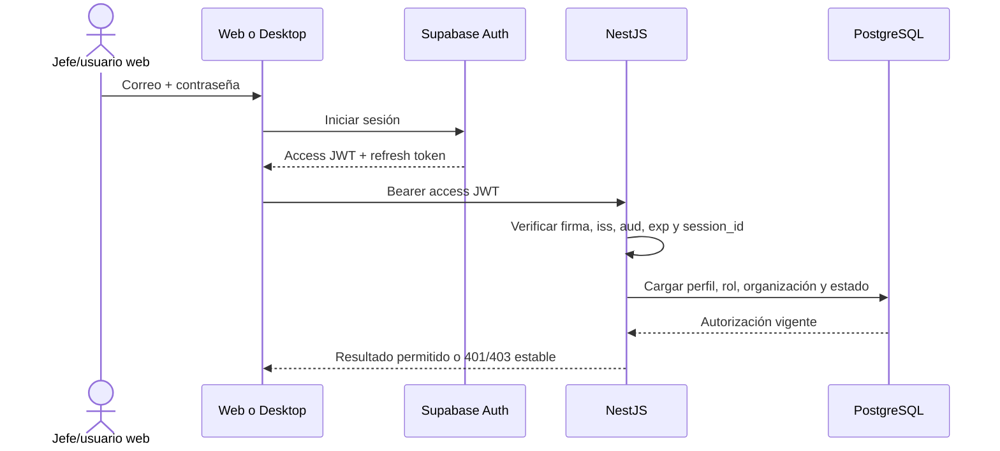

# Identidad, permisos y acceso offline — propuesta 1.1

**Fecha:** 2026-08-17

**Estado:** revisado e implementado; decisión de autorización granular del 2026-08-20

**Fuente funcional:** `docs/requirements/linea-base-funcional-v0.1.md`

## 1. Alcance de esta decisión

Este documento define identidad, cuentas, permisos, estación compartida,
elevación temporal, recuperación, revocación y continuidad offline. No crea
tablas, migraciones, endpoints, clientes, pantallas ni conexión productiva a
Supabase. Esos cambios pertenecen a los prompts 1.2 y posteriores.

Decisiones base:

- Supabase Auth autentica las cuentas; no contiene las reglas de negocio.
- NestJS es la única puerta remota a datos y autoridad de permisos.
- PostgreSQL conserva perfiles, roles, estados, organización y auditoría.
- SQLite conserva operación local y una autorización offline limitada; nunca
  replica contraseñas ni la base de usuarios de Supabase.
- El MVP usa una sola computadora compartida y queda preparado para estaciones
  futuras.

## 2. Identidades y cuentas

Hay tres roles autenticados:

| Rol | Canal principal | Identidad |
| --- | --- | --- |
| `JEFE_EMPRESA` | Web | Cuenta personal con correo y contraseña. |
| `ADMINISTRADOR` | Web | Cuenta personal con permisos individuales concedidos. |
| `JEFE_PLANTA` | Desktop | Cuenta personal con correo/contraseña y PIN individual para elevación local. |

`Modo Operación` no es cuenta, usuario de Supabase ni rol. Es un estado
restringido de la estación habilitada por un jefe de planta. Los trabajadores
regulares son registros del catálogo y no reciben credenciales.

Reglas de identidad:

- `JEFE_EMPRESA` consulta y administra desde una sola cuenta con todos los
  permisos activos; no existe una segunda cuenta obligatoria.
- No existe `GERENTE_ADMINISTRADOR`: la máxima autoridad sigue siendo
  `JEFE_EMPRESA`.
- `ADMINISTRADOR` parte de privilegio mínimo y recibe concesiones atómicas.
- Una cuenta no cambia de rol desde la interfaz ordinaria.
- Ninguna cuenta se comparte y todo acceso privilegiado identifica a una
  persona.

## 3. Aprovisionamiento y recuperación

### 3.1 Primeras cuentas

La primera cuenta `JEFE_EMPRESA` se aprovisiona mediante
un procedimiento único de instalación, ejecutado desde backend/entorno seguro,
sin formulario público ni secretos versionados. Se entregan por canal separado
y obligan a establecer contraseña propia.

### 3.2 Cuentas posteriores

- Jefe de empresa crea/invita la nueva cuenta administrativa y selecciona sus
  permisos iniciales.
- Un administrador con `administrators.create` también puede crear otra cuenta,
  pero solo puede conceder permisos que él mismo posea.
- Cambiar permisos existentes exige `administrators.permissions.manage`; aprobar,
  suspender o reactivar exige `administrators.govern`.
- Administrador crea, suspende o revoca cuentas de jefe de planta.
- Administrador no se autoaprueba, no altera su auditoría y no desactiva la
  última cuenta gerencial activa.
- Jefe de empresa puede suspender una cuenta administrativa ante una emergencia.

### 3.3 Contraseña y PIN

- Toda cuenta autenticada tiene correo válido de recuperación.
- Supabase Auth gestiona contraseña, enlace de recuperación y sesión.
- El PIN no sustituye el login inicial: solo eleva una estación ya habilitada.
- Cada jefe define un PIN individual; nunca existe PIN general de planta.
- El PIN nunca se envía por correo, se muestra a administradores ni se guarda en
  texto claro.
- Administrador inicia un restablecimiento; el jefe establece un PIN nuevo
  después de autenticarse con contraseña completa.

## 4. Flujo de autenticación online

Reglas:

- Web y desktop usan la clave pública solo para Supabase Auth.
- `service_role` existe únicamente en el proceso NestJS/gestor de secretos.
- El JWT prueba identidad y sesión; no es la única fuente de permisos.
- NestJS carga el perfil propio en cada operación protegida para que una
  suspensión o revocación central no dependa de esperar a que expire el JWT.
- En acciones sensibles, NestJS puede comprobar además que `session_id` siga
  activo.
- Los frontends nunca consultan tablas de negocio directamente.

Referencias técnicas oficiales:

- <https://supabase.com/docs/guides/auth/sessions>
- <https://supabase.com/docs/guides/auth/jwts>
- <https://supabase.com/docs/reference/javascript/auth-resetpasswordforemail>

## 5. Matriz de permisos

Leyenda: `Sí`, `No`, `Solicita`, `Aprueba`, `Limitado` y `Posterior`.
`Posterior` fija autoridad para un sprint futuro, no adelanta la función.

| Capacidad | Jefe de empresa | Administrador | Jefe de planta | Modo Operación |
| --- | --- | --- | --- | --- |
| Iniciar sesión | Web | Web | Desktop | No aplica |
| Habilitar estación | Configura/revoca | Según concesión | Sí | No |
| Registrar/revertir última cajuela | Sí, auditado | Según concesión | Sí | Sí |
| Corregir ciclo abierto | Sí | Según concesión | Limitado | Reverso inmediato |
| Corregir ciclo cerrado | Sí, con ajuste | Según concesión | No | No |
| Consultar reportes/estadísticas | Sí | Según concesión | Resumen operativo local | No |
| Confirmar/rechazar entrega de oro | Sí | Según concesión | Posterior, solicita | No |
| Aprobar/suspender administrador | Sí | Con `administrators.govern` | No | No |
| Crear administrador | Sí | Con `administrators.create`; delegación acotada | No | No |
| Asignar permisos administrativos | Sí | Con `administrators.permissions.manage`; solo propios | No | No |
| Gestionar cuenta/PIN de jefe de planta | Sí | Según concesión | Solo su recuperación | No |
| Gestionar planta/líneas/estaciones | Sí | Según concesión | Consulta | Contexto activo |
| Gestionar proveedores | Sí | Según concesión | Sí | Selecciona activo |
| Solicitar trabajador | Consulta | Audita | Sí | No |
| Aprobar/rechazar/fusionar trabajador | Sí | Según concesión | No | No |
| Check-in/out propio del trabajador | Consulta/corrige | Según concesión | Revisa reciente | Posterior |
| Ver foto pendiente hasta 24 h | Sí, auditado | Según concesión | Sí, limitada | No |
| Ver evidencia histórica | Sí, auditado | Según concesión y auditado | No | No |
| Inventario | Sí | Según concesión | Sí | No |
| Alterar o borrar auditoría | No | No | No | No |
| Preferencia `es/en` | Sí | Sí | Sí | Hereda estación |

Restricciones transversales:

- Toda acción se limita a `organization_id`; el MVP no construye administración
  multiempresa.
- Desactivar conserva historial y referencias.
- Correcciones profundas son ajustes/eventos auditados, no `UPDATE`/`DELETE`
  silenciosos.
- Jefe de empresa conserva acceso completo auditado; cada administrador ve solo
  el detalle concedido. Nadie ve tokens, contraseñas o PIN.

## 6. Estación, modos y elevación

### 6.1 Apertura

1. Jefe de planta inicia sesión online con correo/contraseña.
2. NestJS verifica cuenta, perfil, organización y estación autorizada.
3. La estación recibe una autorización offline íntegra, versionada y vinculada a
   jefe + estación, válida por 24 horas.
4. La aplicación entra en Modo Operación.

La autorización offline no es un access token alternativo para llamar a la API.
Es un comprobante local que documenta qué permisos estaban vigentes al perder
conectividad.

### 6.2 Datos locales de seguridad

| Dato | Ubicación | Regla |
| --- | --- | --- |
| Access/refresh token | Almacén seguro de Windows | Nunca SQLite, logs o URL. |
| Autorización offline | Almacén local protegido + referencia SQLite | Firmada/íntegra, jefe/estación, versión y expiración. |
| Verificador de PIN | PostgreSQL protegido + representación en almacén seguro de Windows | Fuente central solo por NestJS y copia local versionada; nunca PIN claro ni SQLite. |
| Perfil/rol cacheado | SQLite | Solo snapshot mínimo para experiencia offline. |
| Eventos y Outbox | SQLite | Transacción local, UUID e historial inmutable. |

El modelo relacional se define en 1.2 y el mecanismo exacto de KDF/protección en
1.8. Esta política prohíbe crear autenticación propia, copiar credenciales de
Supabase o guardar el verificador en SQLite.

### 6.3 Modo Jefe de Planta

- El jefe introduce su PIN individual.
- Cinco fallos dentro de una ventana móvil de 15 minutos bloquean el PIN durante
  15 minutos y generan alerta/auditoría.
- Un segundo bloqueo dentro de 24 horas exige contraseña completa online o
  restablecimiento administrativo antes de volver a usar PIN.
- El bloqueo afecta solo la elevación; Modo Operación continúa.
- El modo privilegiado muestra aviso antes de cerrarse y se bloquea tras dos
  minutos sin interacción real del jefe.
- Registros de cajuelas, check-in, sincronización y actividad de fondo no
  renuevan el temporizador privilegiado.
- Salir manualmente devuelve de inmediato a Modo Operación.
- Si hay un formulario no enviado, el bloqueo lo cubre sin descartarlo; tras
  reautenticación se reanuda en el mismo estado.

### 6.4 Evidencia fotográfica

La captura de evidencia se implementa después de aprobar cámara/privacidad. En
ese momento cada elevación intenta tomar foto. Cámara ausente no bloquea: guarda
`SIN_FOTO`, causa técnica disponible y alerta al administrador. La foto vive en
Storage privado y auditoría conserva referencia/checksum; la retención actual es
indefinida provisional y se revisa en Sprint 6.

## 7. Política offline

### 7.1 Hasta 24 horas

Con autorización vigente se permite:

- Modo Operación, catálogos cacheados y continuidad de cajuelas.
- Reversión inmediata de la última cajuela.
- Check-in/out cuando Sprint 6 lo implemente.
- Apertura/preparación operativa y correcciones rápidas de ciclo abierto por el
  jefe, dentro de sus permisos cacheados.
- Solicitud provisional de trabajador y gestión operativa de proveedor cuando
  sus módulos existan.
- Escritura atómica en SQLite + Outbox con actor, estación, autorización y horas
  de dispositivo.

No se permite offline:

- Crear, aprobar, suspender o recuperar cuentas autenticadas.
- Restablecer PIN o cambiar roles/permisos.
- Autorizar/revocar estaciones.
- Aprobar trabajadores o ejecutar fusiones/reasignaciones.
- Correcciones administrativas de ciclos cerrados, eliminación o configuración
  sensible.
- Acciones de jefe de empresa o administrador web.

### 7.2 Después de 24 horas: contingencia vencida

La planta no se detiene. La estación cambia a contingencia visible:

- Continúan cajuelas, reverso inmediato y check-in/out.
- Se bloquea Modo Jefe de Planta y toda mutación privilegiada.
- Cada evento se marca `AUTORIZACION_VENCIDA_PENDIENTE_REVISION`.
- Se muestran tiempo vencido, estado offline y necesidad de contactar al
  administrador, sin exponer detalles técnicos al trabajador.
- Al recuperar red se exige reautenticación antes de nuevas acciones
  privilegiadas.

Los eventos de contingencia nunca se borran. NestJS los ingiere de forma
idempotente, conserva su contexto y los deja pendientes de revisión cuando no
pueda validarlos automáticamente.

### 7.3 Recuperación de conexión

1. Detener nuevas elevaciones hasta revalidar.
2. Renovar/recuperar sesión de Supabase Auth.
3. Consultar perfil, rol, estación, versión de permisos y revocaciones.
4. Sincronizar eventos con UUID, autorización usada y timestamps.
5. Aceptar, rechazar con causa estable o enviar a revisión sin eliminar la copia
   local confirmada.
6. Aplicar correcciones/configuración central incremental.
7. Emitir una autorización offline nueva si todo sigue activo.

## 8. Bloqueos y revocación

| Situación | Online | Offline | Resultado local |
| --- | --- | --- | --- |
| JWT ausente/alterado/vencido | `401` | No abre sesión nueva | Sin pérdida de eventos. |
| Perfil o cuenta inactiva | `403` y revocación | Se conoce al reconectar o vencer autorización | Modo Operación según contingencia; sin privilegios nuevos. |
| Estación revocada | `403` | Se conoce al reconectar o vencer autorización | Eventos conservados para revisión. |
| Rol insuficiente | `403` | Política cacheada deniega | Sin cambio de datos. |
| Cinco PIN fallidos/15 min | No aplica API ordinaria | Bloqueo PIN 15 min | Modo Operación continúa. |
| Segundo bloqueo PIN/24 h | Requiere contraseña/reset | Elevación bloqueada | Modo Operación continúa. |
| Cámara dañada | Alerta `SIN_FOTO` | Outbox de alerta | No bloquea PIN ni operación. |
| Autorización offline vencida | Reautenticar | Contingencia | Eventos marcados para revisión. |

Una suspensión central no puede viajar mágicamente a una estación desconectada.
La exposición máxima ordinaria es la vigencia de 24 horas; después solo queda la
contingencia restringida.

## 9. Auditoría mínima

Se registran, como mínimo:

- login correcto/fallido, logout, recuperación y revocación;
- creación, aprobación, suspensión y cambio de rol/estado de cuentas;
- estación autorizada/revocada y emisión/vencimiento de autorización offline;
- elevación PIN correcta/fallida, bloqueos, recuperación y salida por timeout;
- entrada/salida de contingencia y reautenticación;
- acción privilegiada con actor, organización, estación, correlación y resultado;
- ausencia de foto, referencia/checksum de evidencia cuando exista y acceso a la
  evidencia;
- decisiones sobre trabajador provisional, rechazo, fusión o reasignación.

Nunca se registran contraseña, PIN, access/refresh token, clave privada, imagen
binaria o URL firmada permanente.

## 10. Compuertas antes de producción

No se adelantan en 1.1, pero son obligatorias antes de producción:

- MFA para cuentas gerenciales y administrativas.
- Enrolamiento y revocación de dispositivos administrativos.
- Política definitiva de fotografías/biometría y prueba de restauración.
- HTTPS, rotación de secretos, rate limiting y alertas de accesos anómalos.
- Prueba de revocación online, 24 horas offline y contingencia vencida.

## 11. Casos para aprobar la pausa 1.1

- Gerente usa una cuenta `JEFE_EMPRESA` para datos y administración.
- Administrador no puede modificar sus propios permisos ni borrar auditoría.
- Administrador delegado no puede conceder o retirar permisos que no posea.
- Jefe abre la estación; trabajador usa Modo Operación sin cuenta.
- Cinco PIN incorrectos bloquean solo la elevación; producción continúa.
- Formulario privilegiado se conserva detrás del bloqueo de dos minutos.
- Cuenta o estación suspendida recibe rechazo online.
- Desconexión de 24 horas mantiene las funciones permitidas.
- Vencimiento entra en contingencia sin perder cajuelas/check-in.
- Reconexión revalida y conserva eventos aunque requieran revisión.
- Contraseña se recupera por correo; PIN no se envía.
- Cámara ausente produce alerta y no bloquea.
- MFA/dispositivo y reconocimiento facial siguen como compuertas posteriores.

## 12. Pendientes que no bloquean esta pausa

- Estructura relacional, nombres definitivos e índices: prompt 1.2.
- Algoritmo/mecanismo concreto de protección Windows y PIN: prompt 1.8.
- Captura, Storage y retención definitiva de fotografías: Sprint 6.
- Reconocimiento facial y precisión: Sprint 6.
- Concurrencia real con varias estaciones: Sprint 3.
