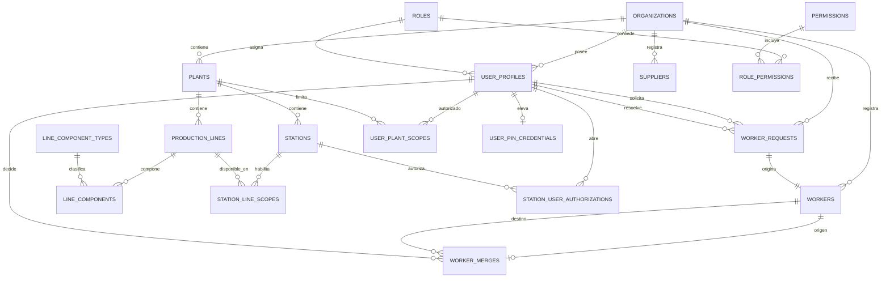
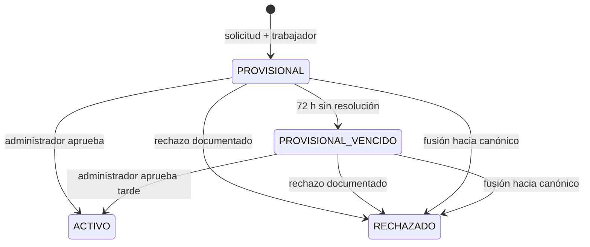

# Modelo relacional de identidad y organización — propuesta 1.2

**Fecha:** 2026-08-17

**Estado:** diseño aprobado e implementado por el prompt 1.3; migraciones
aplicadas a Supabase de desarrollo y pausa 1.3 pendiente de aprobación manual

**Fuentes:**

- `docs/requirements/linea-base-funcional-v0.1.md`
- `docs/architecture/identidad-y-acceso-offline.md`

**Implementación:**
`supabase/migrations/20260817182220_identity_organization.sql`, con seed y
pruebas descritos en `supabase/README.md`.

## 1. Alcance

Este documento diseña el modelo central de identidad, organización y catálogos
iniciales. No crea migraciones, seed, endpoints, OpenAPI, pantallas, conexión a
Supabase, SQLite, fotografías ni biometría.

El diseño cubre:

- una organización con una planta inicial y una segunda planta futura;
- cuatro líneas actuales sin fijar esa cantidad en el esquema;
- un molino y tres rastras actuales por línea sin imponer esa cardinalidad;
- una estación compartida inicial y varias estaciones futuras;
- un jefe de planta actual sin imponer un máximo estructural para el futuro;
- tres roles autenticados, sin cuenta `OPERARIO` ni rol compuesto;
- autorización de jefes por planta/estación y PIN mediante verificador;
- solicitudes y perfiles provisionales de trabajadores sin pérdida al vencer,
  rechazar o fusionar;
- proveedores pertenecientes a la organización.

## 2. Convenciones

### 2.1 Identificadores y aislamiento

- Las entidades de negocio usan `uuid` como clave primaria.
- Toda tabla perteneciente al cliente contiene `organization_id`.
- Las relaciones internas usan claves foráneas compuestas que incluyen
  `organization_id`; conocer un UUID de otra organización no permite enlazarlo.
- `roles`, `permissions`, `role_permissions` y `line_component_types` son
  catálogos globales controlados por migración, no datos editables por usuarios.
- El MVP no implementa administración multiempresa, aunque el aislamiento se
  conserva desde el primer esquema.

### 2.2 Fechas y desactivación

- Fechas centrales: `timestamptz` en UTC.
- Entidades editables: `created_at`, `updated_at`, `is_active` y
  `deactivated_at`; las tablas de vínculo agregan esos campos cuando el vínculo
  tiene ciclo de vida.
- `is_active = true` exige `deactivated_at IS NULL`; una entidad desactivada
  exige fecha.
- No hay borrado en cascada de perfiles, catálogos o vínculos con historial.
- `created_by_profile_id`, `updated_by_profile_id` y motivos se agregan solo
  donde expresan una decisión funcional; la auditoría transversal llega en 1.5.

### 2.3 Nombres y códigos

- Los códigos se guardan sin espacios laterales, en mayúsculas y se comparan de
  forma insensible a mayúsculas/minúsculas.
- Los nombres se guardan recortados y no vacíos.
- Organización: código único global.
- Planta: código y nombre únicos dentro de organización.
- Línea, componente y estación: código y nombre únicos dentro de su contenedor.
- Rol, permiso y tipo de componente: código global único.
- Proveedor: nombre normalizado único dentro de organización como protección
  inicial contra duplicados; se revisa expresamente en la pausa.
- Trabajador: el nombre **no** es único. Homónimos son válidos y no deben
  fusionarse automáticamente.

La migración 1.3 decidirá entre `citext` o índices sobre `lower(btrim(...))` sin
cambiar estas reglas.

## 3. Diagrama entidad–relación

## 4. Cardinalidades aprobables

| Relación | Cardinalidad | Decisión |
| --- | --- | --- |
| Organización → planta | `1:N` | Una planta inicial; una segunda no exige cambiar el esquema. |
| Planta → línea | `1:N` | Cuatro registros actuales; sin `CHECK` que obligue cuatro. |
| Línea → componente | `1:N` | Un molino y tres rastras se representan como filas. |
| Planta → estación | `1:N` | Una estación inicial; cada estación pertenece a una sola planta. |
| Estación ↔ línea | `N:M` | La estación compartida puede controlar varias líneas; el vínculo restringe alcance futuro. |
| Organización → perfil autenticado | `1:N` | Cada cuenta pertenece a una sola organización. |
| Perfil ↔ planta | `N:M` | Permite jefes en más de una planta sin duplicar la cuenta. |
| Jefe ↔ estación | `N:M` | Una estación admite turnos de varios jefes y un jefe puede abrir varias estaciones autorizadas. |
| Perfil → rol | `N:1` | Exactamente un rol por cuenta; `JEFE_EMPRESA` incluye superadministración. |
| Rol ↔ permiso | `N:M` | Capacidades base fijas. |
| Administrador ↔ permiso | `N:M` | Concesiones individuales revocables, con actor y fechas. |
| Solicitud → trabajador | `1:1` | Toda solicitud crea un trabajador provisional en la misma transacción. |
| Trabajador origen → fusión | `1:0..1` | Un duplicado solo puede quedar fusionado una vez. |
| Trabajador destino → fusiones | `1:N` | Un perfil canónico puede recibir varios duplicados. |
| Organización → proveedor | `1:N` | El proveedor puede abastecer distintas plantas de la organización. |

## 5. Catálogos y estados controlados

### 5.1 Roles

`roles.code` contiene exactamente:

- `JEFE_EMPRESA`
- `ADMINISTRADOR`
- `JEFE_PLANTA`

No existe `OPERARIO` ni `GERENTE_ADMINISTRADOR`. Los códigos se crean mediante
migración y no se administran desde UI.

### 5.2 Permisos

`permissions` contiene códigos atómicos estables; `role_permissions` conserva
los mínimos fijos de cada rol y `user_permission_grants` registra concesiones y
revocaciones individuales de `ADMINISTRADOR`. `JEFE_EMPRESA` obtiene todos los
permisos activos. NestJS recalcula la autorización en cada solicitud y nunca
acepta permisos afirmados por el cliente.

Catálogo inicial propuesto (`—` significa no concedido):

| Código | Jefe de empresa | Administrador | Jefe de planta |
| --- | --- | --- | --- |
| `reports.read` | Siempre | Concesión | — |
| `audit.read_redacted` | Sí | — | — |
| `audit.read_operational` | Siempre | Concesión | — |
| `administrators.govern` | Siempre | Concesión | — |
| `administrators.create` | Siempre | Concesión | — |
| `administrators.permissions.manage` | Siempre | Concesión | — |
| `administrators.provision_approved` | Siempre | Concesión | — |
| `plant_managers.manage` | Siempre | Concesión | — |
| `organization_catalogs.read` | Siempre | Concesión | Sí |
| `organization_catalogs.manage` | Siempre | Concesión | — |
| `stations.manage` | Siempre | Concesión | — |
| `stations.open` | — | — | Sí |
| `privilege.elevate` | — | — | Sí |
| `suppliers.manage` | Siempre | Concesión | Sí |
| `workers.read` | Siempre | Concesión | Sí |
| `workers.request` | — | — | Sí |
| `workers.resolve` | Siempre | Concesión | — |
| `cycles.correct_open` | Siempre | Concesión | Sí |
| `cycles.correct_closed` | Siempre | Concesión | — |
| `attendance.review_recent` | — | — | Sí |
| `attendance.correct` | Siempre | Concesión | — |
| `inventory.manage` | Siempre | Concesión | Sí |
| `gold_deliveries.confirm` | Siempre | Concesión | — |
| `profile.locale_update` | Siempre | Base fija | Sí |

Los permisos de asistencia, inventario y oro reservan la autoridad ya aprobada,
pero no implementan esas funciones antes de sus sprints. Registrar cajuelas,
reverso inmediato y check-in/out desde `Modo Operación` se autoriza mediante la
política firmada de estación, no mediante un perfil o fila en
`role_permissions`.

No se modelan:

- roles personalizados;
- herencia de roles;
- permisos editables por organización.

### 5.3 Estados de cuenta

`user_profiles.account_status`:

- `PENDING_APPROVAL`
- `ACTIVE`
- `SUSPENDED`

Las cuentas bootstrap registran un motivo técnico de aprobación inicial. Una
cuenta administrativa posterior requiere aprobación gerencial; suspender Auth
y cambiar el perfil se ejecutará como un solo caso de uso auditable.

### 5.4 Solicitud y trabajador

`worker_requests.status`:

- `PENDING`
- `APPROVED`
- `REJECTED`
- `MERGED`

`workers.status`:

- `PROVISIONAL`
- `PROVISIONAL_VENCIDO`
- `ACTIVO`
- `RECHAZADO`

Vencer no equivale a desactivar. Un trabajador `PROVISIONAL_VENCIDO` conserva
`is_active = true` y puede seguir acumulando eventos. Una fusión deja al origen
`RECHAZADO`, crea `worker_merges` y nunca elimina el perfil ni cambia eventos
históricos silenciosamente.

## 6. Diccionario de datos

Las columnas marcadas `FK tenant` usan una clave foránea compuesta con
`organization_id`. Todos los nombres son propuestas para revisión; 1.3 será la
primera implementación física.

### 6.1 `organizations`

| Columna | Tipo | Nulo | Regla |
| --- | --- | --- | --- |
| `id` | `uuid` | No | PK. |
| `code` | `text` | No | Único global, normalizado. |
| `name` | `text` | No | No vacío. |
| `default_timezone` | `text` | No | Inicialmente `America/Costa_Rica`; debe ser zona IANA válida. |
| `default_locale` | `text` | No | `es` o `en`; valor inicial `es`. |
| `is_active` | `boolean` | No | `true` por defecto. |
| `deactivated_at` | `timestamptz` | Sí | Coherente con `is_active`. |
| `created_at`, `updated_at` | `timestamptz` | No | UTC, gestionados centralmente. |

### 6.2 `plants`

| Columna | Tipo | Nulo | Regla |
| --- | --- | --- | --- |
| `id` | `uuid` | No | PK. |
| `organization_id` | `uuid` | No | FK a organización. |
| `code` | `text` | No | Único por organización. |
| `name` | `text` | No | Único normalizado por organización. |
| `timezone` | `text` | No | Hereda inicialmente de organización; zona IANA. |
| `is_active`, `deactivated_at` | varios | No/Sí | Desactivación coherente. |
| `created_at`, `updated_at` | `timestamptz` | No | UTC. |

### 6.3 `production_lines`

| Columna | Tipo | Nulo | Regla |
| --- | --- | --- | --- |
| `id` | `uuid` | No | PK. |
| `organization_id`, `plant_id` | `uuid` | No | FK tenant a planta. |
| `code` | `text` | No | Único por planta. |
| `name` | `text` | No | Único normalizado por planta. |
| `display_order` | `integer` | No | Mayor que cero; único por planta. |
| `is_active`, `deactivated_at` | varios | No/Sí | No borra componentes/historial. |
| `created_at`, `updated_at` | `timestamptz` | No | UTC. |

No existe columna `line_number` limitada a 1–4 ni cantidad fija de componentes.

### 6.4 `line_component_types`

| Columna | Tipo | Nulo | Regla |
| --- | --- | --- | --- |
| `id` | `uuid` | No | PK. |
| `code` | `text` | No | Único global; inicialmente `MOLINO`, `RASTRA`. |
| `name_es`, `name_en` | `text` | No | Etiquetas no vacías. |
| `is_active` | `boolean` | No | Solo migración puede modificar el catálogo. |
| `created_at`, `updated_at` | `timestamptz` | No | UTC. |

### 6.5 `line_components`

| Columna | Tipo | Nulo | Regla |
| --- | --- | --- | --- |
| `id` | `uuid` | No | PK. |
| `organization_id`, `production_line_id` | `uuid` | No | FK tenant a línea. |
| `component_type_id` | `uuid` | No | FK a tipo global. |
| `code` | `text` | No | Único por línea. |
| `name` | `text` | No | Único normalizado por línea. |
| `display_order` | `integer` | No | Mayor que cero; único por línea. |
| `is_active`, `deactivated_at` | varios | No/Sí | Desactivación coherente. |
| `created_at`, `updated_at` | `timestamptz` | No | UTC. |

Las cuatro líneas actuales obtendrán cuatro filas de componente cada una en el
seed 1.3; la base no impone “uno + tres”.

### 6.6 `stations`

| Columna | Tipo | Nulo | Regla |
| --- | --- | --- | --- |
| `id` | `uuid` | No | PK. |
| `organization_id`, `plant_id` | `uuid` | No | FK tenant a planta. |
| `code` | `text` | No | Único por planta. |
| `name` | `text` | No | Único normalizado por planta. |
| `device_key` | `text` | No | Identificador público aleatorio único; no es secreto ni nombre del equipo. |
| `permission_version` | `integer` | No | Positivo; invalida snapshots/autorizaciones antiguos. |
| `is_active`, `deactivated_at` | varios | No/Sí | Revocar no elimina eventos locales. |
| `created_at`, `updated_at` | `timestamptz` | No | UTC. |

Claves del dispositivo, autorizaciones offline y cursores de sincronización no
se mezclan aquí; pertenecen a 1.8 y Sprint 3.

### 6.7 `station_line_scopes`

| Columna | Tipo | Nulo | Regla |
| --- | --- | --- | --- |
| `organization_id`, `plant_id` | `uuid` | No | Asegura la misma planta. |
| `station_id`, `production_line_id` | `uuid` | No | PK compuesta y dos FK tenant. |
| `is_active`, `deactivated_at` | varios | No/Sí | Conserva alcance histórico. |
| `created_at`, `updated_at` | `timestamptz` | No | UTC. |

Una estación no puede enlazarse con una línea de otra planta.

### 6.8 `roles`

| Columna | Tipo | Nulo | Regla |
| --- | --- | --- | --- |
| `id` | `uuid` | No | PK. |
| `code` | `text` | No | Único global; tres valores aprobados. |
| `name_es`, `name_en` | `text` | No | Etiquetas no vacías. |
| `is_active` | `boolean` | No | Controlado por migración. |
| `created_at`, `updated_at` | `timestamptz` | No | UTC. |

### 6.9 `permissions`

| Columna | Tipo | Nulo | Regla |
| --- | --- | --- | --- |
| `id` | `uuid` | No | PK. |
| `code` | `text` | No | Único global y estable. |
| `description` | `text` | No | Alcance funcional legible. |
| `is_active` | `boolean` | No | Controlado por migración. |
| `created_at`, `updated_at` | `timestamptz` | No | UTC. |

### 6.10 `role_permissions`

| Columna | Tipo | Nulo | Regla |
| --- | --- | --- | --- |
| `role_id`, `permission_id` | `uuid` | No | PK compuesta; FK a catálogos globales. |
| `created_at` | `timestamptz` | No | Momento de la versión de matriz. |

No contiene `user_profile_id`: las excepciones no se ocultan aquí, sino que se
registran explícitamente en `user_permission_grants`.

### 6.10.1 `user_permission_grants`

| Columna | Tipo | Nulo | Regla |
| --- | --- | --- | --- |
| `id` | `uuid` | No | PK del periodo de concesión. |
| `organization_id`, `user_profile_id` | `uuid` | No | Destino de la misma organización; solo `ADMINISTRADOR`. |
| `permission_id` | `uuid` | No | Permiso atómico vigente. |
| `granted_by_profile_id`, `granted_at` | varios | No | Actor y momento de concesión. |
| `revoked_by_profile_id`, `revoked_at` | varios | Sí | Ambos presentes o ambos ausentes; no se borra la fila. |

Un índice único parcial impide dos concesiones activas del mismo permiso. Las
funciones de dominio verifican que un administrador solo cambie capacidades que
él mismo posee.

### 6.11 `user_profiles`

| Columna | Tipo | Nulo | Regla |
| --- | --- | --- | --- |
| `id` | `uuid` | No | PK de dominio. |
| `organization_id` | `uuid` | No | FK tenant. |
| `auth_user_id` | `uuid` | No | Único; FK restringida a `auth.users.id`. |
| `role_id` | `uuid` | No | FK a uno de los tres roles. |
| `display_name` | `text` | No | No vacío; no es credencial. |
| `preferred_locale` | `text` | No | `es` o `en`. |
| `account_status` | estado | No | Pendiente, activa o suspendida. |
| `approved_by_profile_id`, `approved_at` | varios | Sí | Ambos presentes o ambos ausentes. |
| `suspended_by_profile_id`, `suspended_at` | varios | Sí | Ambos presentes o ambos ausentes. |
| `status_reason` | `text` | Sí | Obligatorio al suspender/rechazar aprobación. |
| `is_active`, `deactivated_at` | varios | No/Sí | Baja lógica distinta de suspensión temporal. |
| `created_at`, `updated_at` | `timestamptz` | No | UTC. |

El correo y contraseña permanecen en Supabase Auth; no se duplican aquí. La
cuenta `JEFE_EMPRESA` cubre consulta gerencial y administración privilegiada.

### 6.12 `user_plant_scopes`

| Columna | Tipo | Nulo | Regla |
| --- | --- | --- | --- |
| `organization_id`, `user_profile_id`, `plant_id` | `uuid` | No | PK compuesta y FK tenant. |
| `is_active`, `deactivated_at` | varios | No/Sí | Conserva asignaciones históricas. |
| `created_at`, `updated_at` | `timestamptz` | No | UTC. |

Todo `JEFE_PLANTA` activo necesita al menos una asignación activa. Gerencia y
administración tienen alcance organizacional por rol y no requieren duplicar
todas las plantas en esta tabla.

### 6.13 `station_user_authorizations`

| Columna | Tipo | Nulo | Regla |
| --- | --- | --- | --- |
| `id` | `uuid` | No | PK. |
| `organization_id`, `station_id`, `user_profile_id` | `uuid` | No | FK tenant; combinación única. |
| `authorized_by_profile_id` | `uuid` | No | Administrador que autoriza. |
| `authorized_at` | `timestamptz` | No | UTC. |
| `is_active`, `deactivated_at` | varios | No/Sí | Revocación auditable. |
| `deactivated_by_profile_id`, `deactivation_reason` | varios | Sí | Obligatorios al revocar. |
| `created_at`, `updated_at` | `timestamptz` | No | UTC. |

Solo perfiles `JEFE_PLANTA`, activos y con alcance a la planta de la estación
pueden tener autorización activa. Esta regla requiere caso de uso transaccional
y prueba de integración; un `CHECK` aislado no puede consultar otras tablas.

### 6.14 `user_pin_credentials`

| Columna | Tipo | Nulo | Regla |
| --- | --- | --- | --- |
| `id` | `uuid` | No | PK. |
| `organization_id`, `user_profile_id` | `uuid` | No | FK tenant; un registro por perfil. |
| `verifier` | `text` | No | Resultado opaco de KDF/PHC; nunca PIN claro ni cifrado reversible. |
| `verifier_version` | `integer` | No | Positivo; permite rotar parámetros/formato. |
| `reset_required` | `boolean` | No | Obliga contraseña online antes de nuevo PIN. |
| `failed_attempt_count` | `integer` | No | Mayor o igual a cero. |
| `attempt_window_started_at` | `timestamptz` | Sí | Ventana móvil aprobada. |
| `blocked_until` | `timestamptz` | Sí | Enfriamiento de elevación. |
| `second_block_requires_reset` | `boolean` | No | Refleja segundo bloqueo en 24 horas. |
| `last_success_at`, `changed_at` | `timestamptz` | Sí/No | UTC. |
| `changed_by_profile_id` | `uuid` | No | Jefe autenticado o administrador que inicia reset. |
| `created_at`, `updated_at` | `timestamptz` | No | UTC. |

El verificador central solo es accesible a NestJS. En 1.8 se elegirá la KDF y el
mecanismo para entregar/cachear una representación protegida en Windows después
de autenticación online. SQLite no almacena PIN, verificador ni token. Los
contadores offline se persisten en el almacén protegido y convergen con el
estado central sin reducir un bloqueo más estricto.

### 6.15 `worker_requests`

| Columna | Tipo | Nulo | Regla |
| --- | --- | --- | --- |
| `id` | `uuid` | No | PK. |
| `organization_id`, `plant_id` | `uuid` | No | FK tenant a planta. |
| `requested_by_profile_id` | `uuid` | No | Jefe de planta. |
| `requested_name` | `text` | No | No vacío; snapshot original. |
| `requested_email`, `requested_phone` | `text` | Sí | Contacto opcional; no credencial. |
| `status` | estado | No | Pendiente, aprobada, rechazada o fusionada. |
| `requested_at` | `timestamptz` | No | Hora original UTC. |
| `review_due_at` | `timestamptz` | No | Exactamente `requested_at + 72 horas`. |
| `resolved_by_profile_id`, `resolved_at` | varios | Sí | Ambos presentes cuando deja de estar pendiente. |
| `resolution_reason` | `text` | Sí | Obligatorio para rechazo/fusión. |
| `created_at`, `updated_at` | `timestamptz` | No | UTC. |

La solicitud y su trabajador provisional se crean atómicamente. Expirar el
plazo cambia al trabajador a `PROVISIONAL_VENCIDO`, pero la solicitud sigue
pendiente hasta decisión administrativa. Una resolución `MERGED` exige una fila
`worker_merges` con el mismo `source_request_id` en la misma transacción; el
destino no se duplica en esta tabla.

### 6.16 `workers`

| Columna | Tipo | Nulo | Regla |
| --- | --- | --- | --- |
| `id` | `uuid` | No | PK estable para futuros eventos. |
| `organization_id`, `plant_id` | `uuid` | No | FK tenant a planta de alta. |
| `source_request_id` | `uuid` | No | FK tenant única; relación 1:1. |
| `name` | `text` | No | No vacío; no único. |
| `email`, `phone` | `text` | Sí | Contacto opcional; nunca login. |
| `status` | estado | No | Provisional, vencido, activo o rechazado. |
| `status_changed_at` | `timestamptz` | No | UTC. |
| `is_active`, `deactivated_at` | varios | No/Sí | Vencido sigue activo; baja laboral es separada. |
| `created_at`, `updated_at` | `timestamptz` | No | UTC. |

Los datos del trabajador pueden completarse sin reescribir el snapshot de la
solicitud. Una recontratación reactiva el mismo perfil cuando corresponda; no se
crea un duplicado solo por estar inactivo.

### 6.17 `worker_merges`

| Columna | Tipo | Nulo | Regla |
| --- | --- | --- | --- |
| `id` | `uuid` | No | PK. |
| `organization_id` | `uuid` | No | FK tenant. |
| `source_worker_id` | `uuid` | No | Único; trabajador duplicado. |
| `target_worker_id` | `uuid` | No | Trabajador canónico; distinto del origen. |
| `source_request_id` | `uuid` | No | Solicitud que originó la resolución. |
| `merged_by_profile_id` | `uuid` | No | Administrador. |
| `reason` | `text` | No | No vacío. |
| `merged_at`, `created_at` | `timestamptz` | No | UTC; registro inmutable. |

No se permiten ciclos ni cadenas ambiguas: el destino debe ser canónico y no
puede ser un origen ya fusionado. Los eventos existentes conservan su
`worker_id`; consultas y correcciones resuelven el destino mediante esta
relación. La reasignación de un evento individual se modelará en el módulo que
posea ese evento mediante ajuste compensatorio, nunca actualizando o borrando
el original.

### 6.18 `suppliers`

| Columna | Tipo | Nulo | Regla |
| --- | --- | --- | --- |
| `id` | `uuid` | No | PK. |
| `organization_id` | `uuid` | No | FK tenant. |
| `name` | `text` | No | No vacío; propuesta única normalizada por organización. |
| `email`, `phone` | `text` | Sí | Contacto opcional. |
| `is_active`, `deactivated_at` | varios | No/Sí | Desactivación coherente. |
| `created_at`, `updated_at` | `timestamptz` | No | UTC. |

No se inventan cédula, cuenta bancaria, tarifa ni condiciones comerciales.

## 7. Restricciones que deben llegar a PostgreSQL

1. UUID y timestamps no nulos en entidades.
2. Todas las FK tenant incluyen `organization_id` y usan `ON DELETE RESTRICT`.
3. Ninguna FK permite cruzar organización; estación/línea tampoco cruza planta.
4. Código, nombre y orden únicos según el contenedor indicado.
5. Texto obligatorio recortado y no vacío.
6. `preferred_locale`/`default_locale` solo `es` o `en`.
7. Un `auth_user_id` solo puede tener un perfil y un rol.
8. Un jefe activo necesita alcance de planta antes de autorización de estación.
9. Solo jefe de planta puede poseer PIN/autorización de estación.
10. Un perfil tiene como máximo una credencial PIN.
11. `review_due_at = requested_at + interval '72 hours'`.
12. Resolver una solicitud exige actor/fecha; rechazar o fusionar exige motivo.
13. Fusionar exige una única fila `worker_merges`, destino distinto, misma
    organización y ausencia de ciclos.
14. El vencimiento provisional no desactiva al trabajador.
15. Ninguna desactivación elimina filas referenciadas.

Las reglas 8, 9 y la ausencia de ciclos requieren transacción de aplicación más
pruebas de integración o trigger diferido; no se simularán con `CHECK` que
PostgreSQL no pueda garantizar.

## 8. Índices propuestos

Además de PK, FK y unicidades:

| Tabla | Índice | Uso |
| --- | --- | --- |
| `plants` | `(organization_id, is_active)` | Catálogo activo por organización. |
| `production_lines` | `(organization_id, plant_id, is_active, display_order)` | Panel ordenado por planta. |
| `line_components` | `(organization_id, production_line_id, is_active, display_order)` | Componentes de línea. |
| `stations` | `(organization_id, plant_id, is_active)` | Estaciones disponibles. |
| `user_profiles` | `(organization_id, role_id, account_status, is_active)` | Autorización y administración. |
| `user_plant_scopes` | `(organization_id, plant_id, is_active)` | Jefes asignados. |
| `station_user_authorizations` | `(organization_id, station_id, is_active)` | Apertura de estación. |
| `worker_requests` | `(organization_id, status, review_due_at)` parcial para pendientes | Vencimientos/alertas de 72 h. |
| `workers` | `(organization_id, plant_id, status, is_active)` | Selección y revisión. |
| `workers` | búsqueda normalizada por nombre, no única | Encontrar posibles duplicados sin fusionar automáticamente. |
| `worker_merges` | `(organization_id, target_worker_id)` | Resolver duplicados hacia canónico. |
| `suppliers` | `(organization_id, is_active, name)` | Catálogo y búsqueda. |

No se añaden índices “por si acaso”; 1.3 verificará planes de las consultas
iniciales.

## 9. Ciclo transaccional del trabajador

Invariantes del flujo:

- solicitud y trabajador provisional se confirman juntos;
- el reloj de 72 horas parte de `requested_at`, no de una tarea en segundo plano;
- una tarea idempotente puede materializar `PROVISIONAL_VENCIDO`, pero las
  consultas también detectan pendientes vencidos por `review_due_at`;
- vencimiento, rechazo y fusión nunca borran horas/evidencias;
- aprobación tardía conserva la hora de ingreso y todo lo registrado;
- `worker_merges` conserva origen y destino; no se sobreescribe identidad.

## 10. Forma del seed futuro, no datos del seed

El prompt 1.3 podrá crear datos **completamente ficticios** con esta forma:

- 1 organización;
- 1 planta;
- 4 líneas configurables;
- por cada línea, 1 componente `MOLINO` y 3 `RASTRA`;
- 1 estación vinculada a las cuatro líneas;
- roles, permisos y tipos de componente controlados;
- cuentas bootstrap y datos maestros según el procedimiento seguro de 1.3.

Los números actuales se expresan en filas de seed, no mediante límites,
columnas repetidas ni reglas de cardinalidad.

## 11. Fuera de este modelo

- tablas físicas y migraciones Supabase/PostgreSQL;
- seed con nombres, correos o credenciales;
- RLS, funciones, triggers y política de servicio;
- eventos de auditoría, producción, asistencia o inventario;
- SQLite, Outbox, autorizaciones offline y sincronización;
- almacenamiento de fotografías o plantillas faciales;
- reconocimiento biométrico, nómina y sensores.

## 12. Casos para aprobar la pausa 1.2

1. Una organización admite una segunda planta sin migración estructural.
2. Una planta admite cualquier cantidad de líneas y estaciones.
3. Una línea representa molino/rastras como filas configurables.
4. La estación inicial puede atender las cuatro líneas sin pertenecer a cuatro
   plantas ni duplicarse.
5. Una cuenta tiene un solo rol y `JEFE_EMPRESA` no requiere una segunda cuenta.
6. Un administrador tiene permisos individuales revocables y no puede delegar
   capacidades que no posea.
7. Un jefe puede quedar autorizado para una o más plantas/estaciones.
8. El PIN solo aparece como verificador versionado y estado de bloqueo.
9. Una solicitud crea inmediatamente un trabajador provisional.
10. A las 72 horas continúa activo como provisional vencido.
11. Aprobar, rechazar o fusionar conserva el perfil y futuros eventos.
12. Nombre de trabajador no es único; nombre normalizado de proveedor sí lo es
    en esta propuesta.

Estas cardinalidades y la unicidad normalizada de proveedores fueron aprobadas
mediante el `R` que inició el prompt 1.3.
